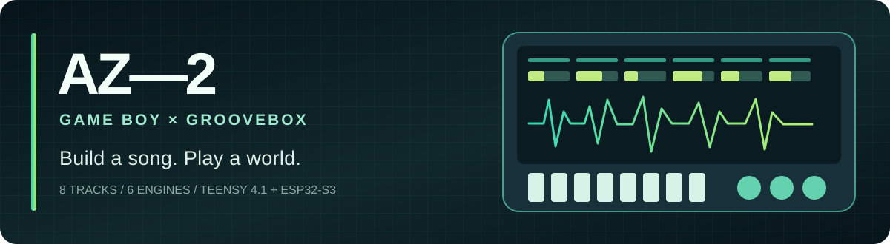

<div align="center">



# AZ-2 · Build a song. Play a world.

**🌐 Documentation : [Français](docs/i18n/README.fr.md) · [English](docs/i18n/README.en.md) · [Español](docs/i18n/README.es.md)**

**Une groovebox DIY à quatre cartes programmables : tracker 8 pistes et neuf moteurs audio. Un chantier d'émulation GB/GBC est présent dans le code, mais aucun émulateur n'est actuellement fonctionnel et validé sur la machine.**

[](https://github.com/propann/L-AZ-2/actions/workflows/ci.yml)


[Découvrir la machine](#la-machine) · [Manuel d'utilisation](docs/AZ2_MANUEL_UTILISATEUR.md) · [Démarrer](#démarrer) · [Architecture](#deux-firmwares-un-seul-instrument) · [Game Boy & LSDJ](#game-boy--lsdj) · [Feuille de route](#feuille-de-route) · [Documentation](#documentation)

</div>

> **AZ-2 est un projet de construction et de recherche, pas un produit fini.** Les fonctions listées comme intégrées existent dans le code ; leur validation sur le matériel réel dépend des essais documentés. Les captures d'écran et visuels de concept ne sont pas des preuves de fonctionnalité.

## La machine

| 🎛️ Créer | 🎮 Jouer | 🎚️ Transformer |
| :-- | :-- | :-- |
| Tracker 8 pistes, patterns, song, swing, effets par pas, mute/solo | Prototype d'émulation GB/GBC non fonctionnel à ce jour | Mixage via Teensy et DAC I²S, sampleur one-shot et infrastructure expérimentale de capture |
| Dexed · ePiano · Braids · Karplus · Analog · Sampler · Drum · Granular · Spectral | Prototypes de navigateur et de cœurs, non validés comme émulateur | Neuf moteurs audio au choix par piste |

**Intention produit :** composer au tracker, jouer à la Game Boy et faire dialoguer le son chiptune avec les synthétiseurs de la machine. La capture WAV est présente et le dernier enregistrement Game Boy peut désormais être chargé en PSRAM comme patch dynamique **SAMPLER / GB Capture** ; la gestion d'une vraie bibliothèque multi-captures reste à développer.

## Quatre firmwares, un seul instrument

```text
      CROIX / A B C D / ENCODEURS
                    │
                    ▼
   ┌──────────────────────────────┐       UART 921600       ┌──────────────────────────────┐
   │ TEENSY 4.1 · MASTER AUDIO    │◄──────────────────────►│ ESP32-S3 · ÉCRAN / GB       │
   │ Tracker, synthés, mixage     │   commandes + audio GB │ Écran tactile 480×480, SD    │
   │ Sampleur, MIDI, DAC I²S      │                        │ Interface + prototypes GB  │
   └───────────────┬──────────────┘                        └──────────────────────────────┘
                   │         I2S/UART         GRANULAR S3 + SPECTRAL WROOM
                   ├────────────────────────► rack de moteurs externes
                   ▼
             PCM5102A → AUDIO OUT
```

**Règle fondamentale : les quatre firmwares sont liés par `lib/AZ2_Protocol/AZ2_Protocol.h`.** Modifier une commande, un débit, une longueur de paquet ou un format audio exige de vérifier toutes les extrémités concernées dans le même changement.

Le prototype actuel utilise le Teensy, l'ESP32-S3 écran, le S3 granulaire et le WROOM spectral. Le Teensy reste maître du temps, de l'I2S, du mixage et du DAC.

## Démarrer

**Prérequis :** matériel décrit dans la [nomenclature de reproduction](docs/AZ2_REPRODUCTION.md) et le [guide de câblage](docs/AZ2_CABLAGE_MASTER.md), carte ESP32-S3 écran VIEWE UEDX48480040E-WB, Teensy 4.1, DAC PCM5102A, cartes SD FAT32, Python et PlatformIO.

```bash
git clone https://github.com/propann/L-AZ-2.git
cd L-AZ-2
python -m pip install platformio==6.1.19

# Compiler les quatre firmwares du prototype rack actif :
pio run -e master_teensy_rack_lab -e screen_esp \
  -e engine_rack_granular_s3_teensy_slave -e engine_rack_spectral_esp32

# Tests natifs du protocole partagé :
pio test -e native

# Téléverser seulement lorsque le matériel/câblage a été vérifié :
pio run -e master_teensy -t upload
pio run -e screen_esp -t upload
```

Le matériel Teensy et l'écran ESP32 disposent de configurations de compilation distinctes dans `platformio.ini`. Les ROM commerciales, les banques de samples et les sauvegardes personnelles ne sont pas incluses dans ce dépôt.

**Avant le premier flash :** lire le [guide d'installation et de sécurité](docs/AZ2_DEMARRAGE.md). Préserver vos fichiers `.sav`, projets et patches SD ; identifier chaque carte avant tout téléversement.

## Game Boy & LSDJ

| Fonction | État |
| :-- | :-- |
| Cœurs Walnut-CGB et GNUBOY | Prototypes présents ; **aucun émulateur GB/GBC fonctionnel et validé actuellement** |
| Chargement ROM, rendu, commandes et sauvegardes | Code expérimental incomplet ; ne constitue pas une fonction livrée |
| Audio V2 séquencé + CRC + L/R PCM8 stéréo | Intégré derrière un pilote désactivé ; sortie Teensy encore downmixée sur le bus mono actuel |
| Sauvegarde SRAM périodique, SAVE NOW sur D, `.sav/.bak` et RTC MBC3 séparé | Intégré ; qualification coupure/RTC sur matériel encore nécessaire |
| Audio GB vers Teensy | Infrastructure intégrée, mais sans émulateur fonctionnel pour valider le chemin complet |
| Audio haute fidélité, APU horodatée et sortie DAC réellement stéréo | **Non livré** ; le transport V2 stéréo est présent mais désactivé par défaut |
| Capture GB → patch SAMPLER / GB Capture | Infrastructure intégrée (un slot dynamique PSRAM), non validée de bout en bout faute d'émulateur fonctionnel |
| Synchronisation musicale LSDJ ↔ tracker | **Non livré** |

Pour le chantier en cours : [roadmap Game Boy / LSDJ détaillée](docs/AZ2_GB_ROADMAP_IMPLEMENTATION.md). Pour les limites de compatibilité : [audit émulation](docs/AZ2_AUDIT_EMULATION_LSDJ_TETRIS_MARIO.md). Pour comprendre pourquoi Walnut-CGB a été retenu : [étude des cœurs](docs/AZ2_ETUDE_COEURS_EMULATION_GB.md).

## Feuille de route

1. **Fiabilité :** sauvegardes résistantes aux coupures, erreurs visibles, chargement sûr et tests sur carte réelle.
2. **Cadence :** mesures et certification par ROM (Tetris, Mario, LSDJ) et sans sacrifice des synthés.
3. **Audio LSDJ :** APU précise, stéréo, pont UART V2 et contrôle des underruns.
4. **Studio :** ergonomie Console/LSDJ, capture WAV → sampleur, synchronisation musicale.
5. **Publication :** photos du prototype réel, schéma reproductible, démonstrations et matrice de compatibilité.

Les cases d'implémentation et les tests d'acceptation figurent dans la [roadmap opérationnelle](docs/AZ2_GB_ROADMAP_IMPLEMENTATION.md). Ne pas confondre « présent dans le code », « compile » et « testé sur l'AZ-2 ».

## Documentation

| Commencer par… | Pour… |
| :-- | :-- |
| [État actuel vérifié](docs/AZ2_ETAT_ACTUEL.md) | Source de vérité : matériel actif, neuf moteurs, rack, MIDI et statut exact GB/GBC |
| [Reproduire AZ-2](docs/AZ2_REPRODUCTION.md) | Liste des pièces, câblage, cartes SD, compilation et contrôle final |
| [Guide en français](docs/i18n/README.fr.md) · [English guide](docs/i18n/README.en.md) · [Guía en español](docs/i18n/README.es.md) | Découvrir le projet, compiler les firmwares, comprendre les fonctions livrées et leurs limites |
| [Manuel d'utilisation](docs/AZ2_MANUEL_UTILISATEUR.md) | Jouer avec la machine : pages, contrôles, sauvegarde, premier beat |
| [Premier démarrage](docs/AZ2_DEMARRAGE.md) | Préparer les deux cartes, les SD et les compilations |
| [Architecture double firmware](docs/AZ2_ARCHITECTURE_FIRMWARE_DOUBLE.md) | Comprendre les responsabilités de chaque cerveau |
| [Câblage maître](docs/AZ2_CABLAGE_MASTER.md) | Relier commandes, Teensy, écran et DAC |
| [État des lieux](docs/AZ2_ETAT_DES_LIEUX.md) | Séparer observations matérielles et code théorique |
| [État vérifié au 20 septembre](docs/AZ2_ETAT_2026-09-20.md) | Situer les deux cartes SD, les démos projet et les essais restant sur le prototype |
| [Travail livré / journal trilingue](docs/i18n/README.fr.md#travail-réalisé-et-traçabilité--19-septembre-2026) | RTC MBC3, transport V2 stéréo, capture → sampleur et preuve CI |
| [Audit racks / transition CONSOLE + CAPTURE](docs/AZ2_AUDIT_RACKS_CONSOLE_CAPTURE.md) | Mesurer les gains possibles, prioriser jeu + WAV et transitionner par étapes vérifiées |
| [Roadmap Game Boy](docs/AZ2_GB_ROADMAP_IMPLEMENTATION.md) | Suivre les étapes de stabilisation et LSDJ |
| [Validation GB/LSDJ](docs/AZ2_GB_VALIDATION.md) | Tester cadence, sauvegardes, jeux et capture sur le prototype |
| [Roadmap générale](docs/AZ2_FEUILLE_DE_ROUTE.md) | Tracker, moteurs, interface et produit |
| [Licences et composants tiers](docs/AZ2_LICENCES.md) | Vérifier provenance et obligations avant redistribution |

## Contribuer

Voir [CONTRIBUTING.md](CONTRIBUTING.md). Un bug reproductible, une capture de logs, un test de ROM libre ou une amélioration de documentation sont utiles. Indiquez le SHA Git, l'environnement `master_teensy` / `screen_esp`, le matériel et les étapes de reproduction. Évitez d'ajouter au dépôt des ROM commerciales ou des fichiers de sauvegarde personnels.

Code principal sous **GPL-3.0** ; plusieurs composants intégrés possèdent leurs propres licences. Voir [LICENSE](LICENSE) et [inventaire des licences](docs/AZ2_LICENCES.md).

---

<div align="center"><sub>AZ-2 — Fabriquer un instrument, pas seulement assembler des composants.</sub></div>

## Probe RGB double framebuffer

Le pilote RGB direct est testable sans modifier le firmware AZ-Tracker :

```bash
pio run -e screen_esp_rgb_direct_probe
pio run -e screen_esp_rgb_direct_probe -t upload
```

Ce probe utilise `esp_lcd` à 12 MHz, deux framebuffers PSRAM et le callback
`on_frame_buf_complete`. Il alterne deux aplats de couleur pour vérifier la
rotation des buffers. Le firmware principal reste dans `screen_esp`.
