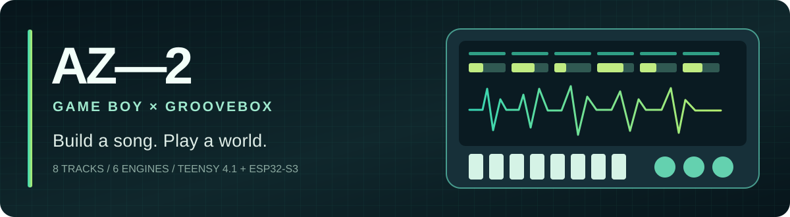

<div align="center">



# AZ-2 · Build a song. Play a world.

**🌐 Documentation : [Français](docs/i18n/README.fr.md) · [English](docs/i18n/README.en.md) · [Español](docs/i18n/README.es.md)**

**Une groovebox DIY à plusieurs firmwares : tracker 8 pistes, neuf moteurs audio équilibrés, une chaîne de 14 effets par piste, et une console de jeu intégrée — Game Boy et Game Boy Color à pleine vitesse (59,7 fps en X2 et X3), NES en cours d'optimisation.**

[](https://github.com/propann/L-AZ-2/actions/workflows/ci.yml)


[Découvrir la machine](#la-machine) · [Manuel d'utilisation](docs/AZ2_MANUEL_UTILISATEUR.md) · [Démarrer](#démarrer) · [Architecture](#deux-firmwares-un-seul-instrument) · [Son & effets](#son--effets) · [Émulation](#émulation) · [Feuille de route](#feuille-de-route) · [Documentation](#documentation)

</div>

> **AZ-2 est un projet de construction et de recherche, pas un produit fini.** Les fonctions listées comme intégrées existent dans le code ; leur validation sur le matériel réel dépend des essais documentés. Les captures d'écran et visuels de concept ne sont pas des preuves de fonctionnalité.

## La machine

| 🎛️ Créer | 🎮 Jouer | 🎚️ Transformer |
| :-- | :-- | :-- |
| Tracker 8 pistes, patterns, song, swing, effets et verrous de paramètre par pas, mute/solo | Game Boy + Game Boy Color (Walnut-CGB) validés à 59,7 fps en X2 et X3 ; NES à 49–50 fps | 14 effets par piste (drive, crush, filtre LP/BP/HP + LFO, tremolo, ring, flanger, delay synchronisé, envoi reverb), 12 presets, bus reverb/delay/chorus |
| Dexed · ePiano · Braids · Karplus · Analog · Sampler · Drum · Granular · Spectral — niveaux équilibrés par moteur et par patch | Rack audio externe fonctionnel : GRANULAR S3 + SPECTRAL WROOM ; réglages fins encore en qualification | Mode EFFETS au clic de l'encodeur 3 depuis presque toutes les pages, capture GB → WAV → sampleur |

**Intention produit :** composer au tracker, jouer à la Game Boy et faire dialoguer le son chiptune avec les synthétiseurs de la machine. La capture WAV est présente et le dernier enregistrement Game Boy peut désormais être chargé en PSRAM comme patch dynamique **SAMPLER / GB Capture** ; la gestion d'une vraie bibliothèque multi-captures reste à développer.

## Quatre firmwares, un seul instrument

```text
      CROIX / A B C D / ENCODEURS
                    │
                    ▼
   ┌──────────────────────────────┐       UART 921600       ┌──────────────────────────────┐
   │ TEENSY 4.1 · MASTER AUDIO    │◄──────────────────────►│ ESP32-S3 · ÉCRAN / CONSOLE   │
   │ Tracker, synthés, mixage     │   commandes + audio GB │ Écran tactile 480×480, SD    │
   │ Sampleur, DAC I²S            │                        │ Interface, GB/GBC, NES       │
   └───────────────┬──────────────┘                        └──────────────────────────────┘
                   │         I2S/UART         GRANULAR S3 + SPECTRAL WROOM
                   ├────────────────────────► rack de moteurs externes
                   ▼
             PCM5102A → AUDIO OUT
```

**Règle fondamentale : les quatre firmwares sont liés par `lib/AZ2_Protocol/AZ2_Protocol.h`.** Modifier une commande, un débit, une longueur de paquet ou un format audio exige de vérifier toutes les extrémités concernées dans le même changement.

Le prototype actuel utilise le Teensy, l'ESP32-S3 écran, le S3 granulaire et le WROOM spectral. Le Teensy reste maître du temps, de l'I2S, du mixage et du DAC.

## Démarrer

**Prérequis :** matériel décrit dans la [nomenclature de reproduction](docs/AZ2_REPRODUCTION.md) et le [guide de câblage](docs/AZ2_CABLAGE_MASTER.md), carte ESP32-S3 écran VIEWE UEDX48480040E-WB, Teensy 4.1, DAC PCM5102A, cartes SD FAT32, Python et PlatformIO.

```bash
git clone https://github.com/propann/L-AZ-2.git
cd L-AZ-2
python -m pip install platformio==6.1.19

# Compiler les quatre firmwares du prototype rack actif :
pio run -e master_teensy_rack_lab -e screen_esp_walnut_gbc_core_task \
  -e engine_rack_granular_s3_teensy_slave -e engine_rack_spectral_esp32

# Tests natifs du protocole partagé :
pio test -e native

# Téléverser seulement lorsque le matériel/câblage a été vérifié :
pio run -e master_teensy_rack_lab -t upload
pio run -e screen_esp_walnut_gbc_core_task -t upload
```

Le matériel Teensy et l'écran ESP32 disposent de configurations de compilation distinctes dans `platformio.ini`. Les ROM commerciales, les banques de samples et les sauvegardes personnelles ne sont pas incluses dans ce dépôt.

**Avant le premier flash :** lire le [guide d'installation et de sécurité](docs/AZ2_DEMARRAGE.md). Préserver vos fichiers `.sav`, projets et patches SD ; identifier chaque carte avant tout téléversement.

## Son & effets

Chaque piste a sa **propre chaîne d'effets**, indépendante du moteur :

```text
moteur → filtre LP/BP/HP (+ LFO) → drive → crush → tremolo / ring mod → flanger
       → delay + feedback (synchronisable) → volume → envoi reverb → bus général (reverb, delay, chorus)
```

| Fonction | État |
| :-- | :-- |
| Niveaux des 9 moteurs et des 523 patches Teensy | **Équilibrés** par mesure automatique ([`tools/engine_bench.py`](tools/engine_bench.py)) : l'écart allait jusqu'à ×25 entre moteurs |
| Section EFFETS (page PATCH) + 12 presets | Validée au banc et à l'écoute ; sauvegardée dans le projet |
| Effets de pas et verrous de paramètre (DRIVE, WAH, REVRB, RING, TREM, FLANG, DMIX) | Validés au banc |
| Mode EFFETS à l'encodeur 3, ligne MASTER du MIXER | Livrés |
| Charge Teensy | CPU 8–12 %, mémoire audio ≤ 310/700 blocs |

Guide joueur : [Manuel, §7 bis « Les effets »](docs/AZ2_MANUEL_UTILISATEUR.md#7-bis-les-effets). Détail technique et mesures : [état actuel](docs/AZ2_ETAT_ACTUEL.md). Historique : [CHANGELOG](CHANGELOG.md).

## Émulation

La page **ÉMULATEURS** propose trois cartes. Chaque carte ne liste que ses propres ROM, rangées dans `/games` sur la SD de l'écran (sous-dossiers acceptés).

| Carte | Cœur | ROM | Cadence mesurée sur la machine |
| :-- | :-- | :-- | :-- |
| GAME BOY | Walnut-CGB | `.gb` | **59,7 fps** en X2 et X3 |
| GAME BOY COLOR | Walnut-CGB | `.gbc` | **59,7 fps** en X2 et X3 |
| NES | Anemoia-ESP32 | `.nes` | 49–50 fps (~82 %), frameskip actif |

| Fonction | État |
| :-- | :-- |
| Affichage double cœur | Le cœur 1 émule, le cœur 0 agrandit et dessine ; 30 Hz à l'écran en X2, 20 Hz en X3, jeu et son à 59,7 Hz |
| Son GB vers Teensy | 14 kHz mono, asservi sur l'horloge audio du Teensy, sans clic |
| Sauvegardes | SRAM `.sav/.bak` automatique (30 s, seulement si modifiée), SAVE NOW, RTC MBC3 séparé |
| Capture GB → WAV / SAMPLER | Validée : WAV sur SD Teensy, dernier fichier chargé dans `SAMPLER / GB Capture` |
| Audio stéréo / V2 | Transport V2 présent mais désactivé ; sortie Teensy mono |
| Synchronisation musicale LSDJ ↔ tracker | **Non livré** |

Mesures et détails : [état actuel vérifié](docs/AZ2_ETAT_ACTUEL.md). La Neo Geo Pocket (cœur RACE, GPLv2 seule) a été retirée le 2 octobre 2026 pour incompatibilité de licence.

## Feuille de route

1. **Fiabilité :** sauvegardes résistantes aux coupures, erreurs visibles, chargement sûr et tests sur carte réelle.
2. **Cadence :** mesures et certification par ROM (Tetris, Mario, LSDJ) et sans sacrifice des synthés.
3. **Audio LSDJ :** APU précise, stéréo, pont UART V2 et contrôle des underruns.
4. **Studio :** ergonomie Console/LSDJ, capture WAV → sampleur, synchronisation musicale.
5. **Publication :** photos du prototype réel, schéma reproductible, démonstrations et matrice de compatibilité.

Les cases d'implémentation et les tests d'acceptation figurent dans la [roadmap opérationnelle](docs/AZ2_GB_ROADMAP_IMPLEMENTATION.md). Ne pas confondre « présent dans le code », « compile » et « testé sur l'AZ-2 ».

## Documentation

| Commencer par… | Pour… |
| :-- | :-- |
| [État actuel vérifié](docs/AZ2_ETAT_ACTUEL.md) | Source de vérité : matériel actif, moteurs et effets, rack, mesures GB/GBC/NES |
| [CHANGELOG](CHANGELOG.md) | Ce qui a changé, version par version, avec les mesures |
| [Reproduire AZ-2](docs/AZ2_REPRODUCTION.md) | Liste des pièces, câblage, cartes SD, compilation et contrôle final |
| [Guide en français](docs/i18n/README.fr.md) · [English guide](docs/i18n/README.en.md) · [Guía en español](docs/i18n/README.es.md) | Découvrir le projet, compiler les firmwares, comprendre les fonctions livrées et leurs limites |
| [Manuel d'utilisation](docs/AZ2_MANUEL_UTILISATEUR.md) | Jouer avec la machine : pages, contrôles, sauvegarde, premier beat |
| [Premier démarrage](docs/AZ2_DEMARRAGE.md) | Préparer les deux cartes, les SD et les compilations |
| [Architecture double firmware](docs/AZ2_ARCHITECTURE_FIRMWARE_DOUBLE.md) | Comprendre les responsabilités de chaque cerveau |
| [Câblage maître](docs/AZ2_CABLAGE_MASTER.md) | Relier commandes, Teensy, écran et DAC |
| [État des lieux](docs/AZ2_ETAT_DES_LIEUX.md) | Séparer observations matérielles et code théorique |
| [État vérifié au 20 septembre](docs/AZ2_ETAT_2026-09-20.md) | Situer les deux cartes SD, les démos projet et les essais restant sur le prototype |
| [Travail livré / journal trilingue](docs/i18n/README.fr.md#travail-réalisé-et-traçabilité--19-septembre-2026) | RTC MBC3, transport V2 stéréo, capture → sampleur et preuve CI |
| [Audit racks / transition CONSOLE + CAPTURE](docs/AZ2_AUDIT_RACKS_CONSOLE_CAPTURE.md) | Mesurer les gains possibles, prioriser jeu + WAV et transitionner par étapes vérifiées |
| [Roadmap Game Boy](docs/AZ2_GB_ROADMAP_IMPLEMENTATION.md) | Suivre les étapes de stabilisation et LSDJ |
| [Validation GB/LSDJ](docs/AZ2_GB_VALIDATION.md) | Tester cadence, sauvegardes, jeux et capture sur le prototype |
| [Roadmap générale](docs/AZ2_FEUILLE_DE_ROUTE.md) | Tracker, moteurs, interface et produit |
| [Licences et composants tiers](docs/AZ2_LICENCES.md) | Vérifier provenance et obligations avant redistribution |

## Contribuer

Voir [CONTRIBUTING.md](CONTRIBUTING.md). Un bug reproductible, une capture de logs, un test de ROM libre ou une amélioration de documentation sont utiles. Indiquez le SHA Git, l'environnement (`master_teensy_rack_lab` / `screen_esp_walnut_gbc_core_task`), le matériel et les étapes de reproduction. Évitez d'ajouter au dépôt des ROM commerciales ou des fichiers de sauvegarde personnels.

Code principal sous **GPL-3.0** ; plusieurs composants intégrés possèdent leurs propres licences. Voir [LICENSE](LICENSE) et [inventaire des licences](docs/AZ2_LICENCES.md).

---

<div align="center"><sub>AZ-2 — Fabriquer un instrument, pas seulement assembler des composants.</sub></div>
