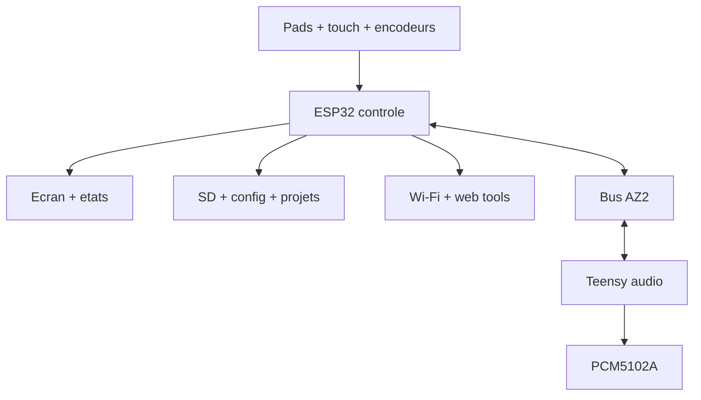

# AZ-2 - Architecture firmware double cerveau

Objectif: definir proprement la repartition ESP32 / Teensy pour obtenir une groovebox rapide, robuste et facile a faire evoluer.

## Principe general

Regle: l'ESP32 s'occupe de comprendre l'humain. Le Teensy s'occupe de ne jamais rater le son.

## Responsibilities

| Fonction | ESP32 | Teensy | Raison |
| --- | --- | --- | --- |
| Ecran 480x480 | Maitre | Aucun | L'ecran est physiquement sur l'ESP32 |
| Touch | Maitre | Aucun | Entree UI non critique audio |
| Croix + 4 boutons + 3 encodeurs | Recoit events | Maitre (cables directement dessus) | **[Revu 2026-09-17]** remplace la matrice 4x4/LEDs prevues ici -- abandonnees le 2026-09-14 (mux LED jamais fonctionnel, voir AZ2_CABLAGE_PICO.md), plus de retour LED physique par pad |
| Wi-Fi | Maitre | Aucun | Risque de jitter, donc loin du son -- **jamais commence**, pas prioritaire |
| SD ecran | Maitre | Acces indirect | L'ESP32 gere fichiers, transferts, index |
| Web config | Maitre | Aucun | Hors temps reel |
| Projet/presets UI | Maitre | Applique snapshot | L'ESP32 montre et sauve, le Teensy joue |
| Synthese | Aucun | Maitre | Temps reel audio |
| Sample (capture) | Declenche REC/STOP | Capture + ecrit le `.wav` | **[Revu 2026-09-17]** carte SD DEDIEE sur le Teensy (`BUILTIN_SDCARD`), pas indexee par l'ESP32. Lecture (playback) pas encore concue |
| Sequencer critique | Shadow/UI | Maitre v0 | Le timing musical doit rester cote Teensy |
| Tempo/clock interne | Affiche/controle | Maitre v0 | Evite dependance UI pour le groove |
| MIDI/CV | Aucun | Maitre | **[Revu 2026-09-17]** notes IN faites (USB MIDI Teensy -> voix live) ; sync/OUT/CV toujours hors v0 |
| Logs | Collecte | Envoie status | ESP32 agrege pour SD/web |

## Pourquoi cette repartition

Un ESP32-S3 est excellent pour interface, ecran, Wi-Fi et fichiers. Il est moins ideal comme coeur audio si on active reseau, tactile, SD et affichage en meme temps.

Le Teensy 4.1 est excellent pour audio temps reel avec la librairie Audio et un DAC I2S PCM5102A. Il doit rester concentre:

- pas d'ecran;
- pas de Wi-Fi;
- pas de menus;
- pas de parsing lourd dans la boucle audio;
- pas de stockage opaque indispensable pour jouer.

## Bus AZ2 v0

Le bus v0 est un UART texte compact a `230400` bauds. C'est volontaire: lisible au moniteur serie, debuggable, assez rapide pour demarrer.

### Messages ESP32 -> Teensy

| Message | Exemple | Effet |
| --- | --- | --- |
| Hello | `HELLO:ESP32_CONTROL` | Handshake boot |
| Play | `PLAY` | Demarre transport |
| Stop | `STOP` | Stop/mute transport |
| Pad down | `PAD:03:DOWN:vel=110` | Declenche pad 3 |
| Pad up | `PAD:03:UP:vel=0` | Relache pad 3 |
| Tempo | `BPM:128.00` | Change tempo |
| Pattern | `PATTERN:02` | Change pattern |
| Snapshot | `SNAP:...` | Futur: etat compact |

### Messages Teensy -> ESP32

| Message | Exemple | Effet |
| --- | --- | --- |
| Hello | `HELLO:TEENSY_AUDIO` | Audio pret |
| Status | `STATUS:AUDIO:READY` | Affichage et logs |
| LED | `LED:03:ON` | Etat confirme d'un pad |
| Clock | `CLOCK:bar=1:step=7` | UI suit le sequencer |
| Error | `ERR:DAC:NO_AUDIO` | Affichage alerte |

## Bus AZ2 v1 futur

Quand le v0 joue bien, on pourra ajouter un protocole binaire versionne:

| Champ | Taille | Note |
| --- | --- | --- |
| Magic | 1 octet | `0xA2` |
| Version | 1 octet | Commence a `1` |
| Type | 1 octet | Pad, clock, param, led, file |
| Length | 1 octet | Payload court |
| Payload | 0-255 | Donnees |
| CRC | 1 octet | Detection erreur simple |

Decision: ne pas passer en binaire trop tot. Le texte est plus lent, mais il nous fait gagner des semaines de debug.

## Cadences

| Boucle | Cible | Responsable |
| --- | --- | --- |
| Audio callback | Selon librairie Audio Teensy | Teensy |
| Scan boutons | 500 Hz a 1 kHz | ESP32 |
| Debounce | 5 a 15 ms selon pads | ESP32 |
| LED refresh | 100 Hz minimum | ESP32 |
| UI refresh | 30 a 60 fps | ESP32 |
| Status Teensy | 2 a 10 Hz | Teensy |
| Logs SD | Batch, jamais temps reel | ESP32 |
| Wi-Fi web | Seulement hors performance ou AP leger | ESP32 |

## Etats de machine

| Etat | ESP32 | Teensy |
| --- | --- | --- |
| Boot | Affiche splash, coupe Wi-Fi, cherche SD | Initialise audio/DAC |
| Link | Envoie hello, attend hello audio | Repond hello/status |
| Ready | UI active, pads scannes | Audio pret, mute controle |
| Play | Affiche transport/steps | Sequenceur audio actif |
| Error | Affiche diagnostic, log SD | Envoie erreur ou mute |
| Update | Mode maintenance | Reboot/flash selon cible |

## Gestion de fichiers

Le stockage principal est cote ESP32, sur la SD de l'ecran.

| Fichier | Responsable | Usage |
| --- | --- | --- |
| `/az2/config/hardware.json` | ESP32 | Pins, mux, options carte |
| `/az2/config/ui.json` | ESP32 | Theme, pages, luminosite |
| `/az2/config/wifi.json` | ESP32 | AP/STA, jamais obligatoire |
| `/az2/projects/*/project.json` | ESP32 | Projet lisible |
| `/az2/projects/*/patterns/*.json` | ESP32 | Patterns editables |
| `/az2/projects/*/presets/*.json` | ESP32 + Teensy | Parametres moteur |
| `/az2/projects/*/samples/*` | ESP32 puis Teensy | Samples a indexer |
| `/az2/logs/*.log` | ESP32 | Debug atelier |

## Strategie samples

Pour v0, ne pas promettre le streaming audio depuis SD tant qu'il n'est pas teste. Trois niveaux:

| Niveau | Strategie | Risque |
| --- | --- | --- |
| A | Samples courts envoyes/charges en RAM Teensy | Simple, limite |
| B | Index SD cote ESP32, transfert vers Teensy au chargement projet | Bon compromis |
| C | Streaming temps reel depuis stockage | Complexe, a tester tard |

## UI ESP32

L'UI doit etre une console d'instrument, pas une page web maquillee.

Pages v0:

- Home: projet, BPM, etat audio, niveau, SD/Wi-Fi;
- Performance: grille 4x4, mutes, scenes;
- Sequencer: steps, pattern, variation;
- Sound: moteur, preset, macros;
- Mixer: volume/pan/fx/mute;
- Hardware Test: pads, LEDs, UART, SD, DAC.

## Teensy audio

Le firmware Teensy commence avec un test sine -> PCM5102A, puis evolue:

1. Audio test stable.
2. Pad -> voix simple.
3. Polyphonie minimale.
4. Mixer interne.
5. MicroDexed engine isole.
6. Sequencer timing cote Teensy.
7. Presets et patterns appliques depuis ESP32.

## Regles de robustesse

- Le Teensy ne depend pas du Wi-Fi.
- L'ESP32 peut redemarrer sans faire hurler le DAC.
- Le Teensy envoie un heartbeat.
- L'ESP32 affiche la perte de lien.
- Les pads peuvent reagir localement en LED avant confirmation audio.
- Les gros transferts fichiers ne se font pas pendant une prise live.
- Chaque firmware a son mode test autonome.

## Decision importante

Le sequenceur maitre doit vivre cote Teensy en v0. L'ESP32 peut afficher, editer et preparer, mais le timing du groove ne doit pas traverser l'UI a chaque step. C'est la difference entre une machine qui clignote et une machine qui joue.

