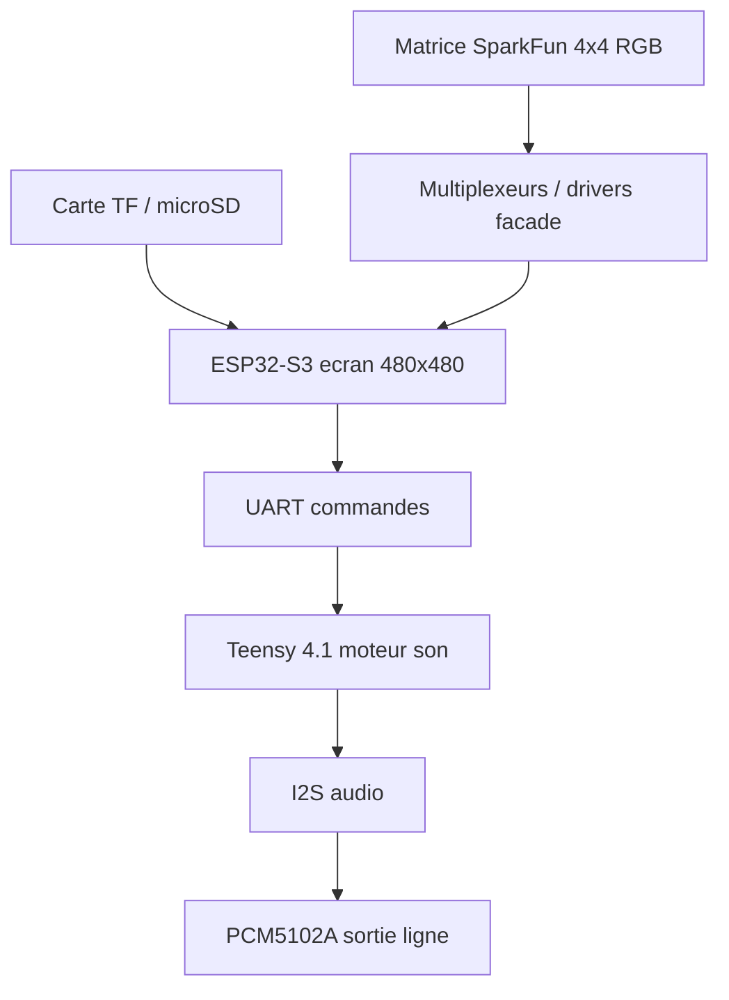

# AZ-2 - Cablage complet v0

Objectif: demarrer la groovebox avec un cablage clair, deux firmwares PlatformIO, et des points a completer seulement la ou il manque encore une reference exacte.

## Architecture generale



## Roles figes

| Bloc | Role | Firmware |
| --- | --- | --- |
| ESP32-S3 ecran 4 pouces | Tete de controle, UI, scan matrice, LEDs, Wi-Fi, SD | `src_esp32/az2_control` |
| Matrice SparkFun 4x4 RGB | Pads, steps, mutes, scenes, feedback LED | Geree par ESP32 |
| Multiplexeurs / drivers | Economie de GPIO, scan boutons, pilotage LEDs | Pins a renseigner |
| Teensy 4.1 | Moteur son, sequenceur, synthese MicroDexed adaptee | `src_teensy/az2_audio` |
| PCM5102A | DAC audio stereo I2S, sortie ligne | Sortie du Teensy |
| MIDI / CV | Hors scope v0 | Plus tard |

## Alimentation et masses

| Rail | Alimente | Note |
| --- | --- | --- |
| 5 V | Module ecran ESP32 si entree USB-C/module | Selon carte ecran |
| 3.3 V | PCM5102A, logique multiplexeurs, signaux | Ne pas injecter 5 V sur GPIO |
| GND commun | ESP32, Teensy, PCM5102A, matrice, mux | Obligatoire pour UART/I2S/scan |

Regle dure: tous les signaux logiques doivent rester en 3.3 V.

## ESP32 vers Teensy

Le lien ESP32 -> Teensy commence en UART serie simple. USB MIDI viendra plus tard si besoin.

| Signal | ESP32 | Teensy | Note |
| --- | --- | --- | --- |
| TX ESP32 | A renseigner | RX Teensy | Commandes `PAD`, `PLAY`, `STOP` |
| RX ESP32 | A renseigner | TX Teensy | Etat audio, LED, pattern |
| GND | GND | GND | Masse commune obligatoire |

Debit cible: `230400`.

## PCM5102A vers Teensy 4.1

Le PCM5102A est le DAC audio principal. Il sort un niveau ligne 2.1 VRMS et ne demande pas de MCLK.

| PCM5102A | Teensy 4.1 | Note |
| --- | --- | --- |
| VCC / VIN | 3.3 V | Module annonce en 3.3 V |
| GND | GND | Masse commune |
| BCK / BCLK | Pin 21 | Bit clock I2S Teensy 4.x |
| LCK / LRCK / WS | Pin 20 | Word select / left-right clock |
| DIN | Pin 7 | Data out I2S Teensy |
| SCK / MCLK | Non connecte | PCM5102A: MCLK non requis |
| XSMT / MUTE | GPIO optionnel | Mute logiciel plus tard |

Sortie jack: vers entree ligne, enceinte amplifiee, mixette ou ampli. Pas un ampli casque direct.

## Matrice SparkFun 4x4 RGB

Le guide SparkFun explique que la carte 4x4 est une matrice: les boutons utilisent lignes/colonnes, et les LEDs RGB sont trois matrices superposees avec cathodes communes par colonnes. Les connexions du bas sont plutot des colonnes que de vrais grounds.

Source de reference: `https://learn.sparkfun.com/tutorials/button-pad-hookup-guide/all`

### Logique de scan

| Element | Principe |
| --- | --- |
| Boutons | Selectionner une colonne, lire les lignes |
| LEDs rouges | Selectionner une colonne cathode, piloter les lignes rouges |
| LEDs vertes | Meme logique avec lignes vertes |
| LEDs bleues | Meme logique avec lignes bleues |
| Anti-rebond | Cote ESP32 avant envoi au Teensy |
| Multi-appuis | Prevoir diodes ou filtrage si necessaire |

### Nommage AZ-2

Pour eviter les confusions du silkscreen SparkFun, AZ-2 nomme les axes comme ceci:

| Axe | Nom AZ-2 | Pads |
| --- | --- | --- |
| Colonne A | `COL_0` | 0, 4, 8, 12 |
| Colonne B | `COL_1` | 1, 5, 9, 13 |
| Colonne C | `COL_2` | 2, 6, 10, 14 |
| Colonne D | `COL_3` | 3, 7, 11, 15 |
| Ligne 1 | `ROW_0` | 0, 1, 2, 3 |
| Ligne 2 | `ROW_1` | 4, 5, 6, 7 |
| Ligne 3 | `ROW_2` | 8, 9, 10, 11 |
| Ligne 4 | `ROW_3` | 12, 13, 14, 15 |

### Mapping pad_id

| Ligne | Pads |
| --- | --- |
| Ligne 1 | 0, 1, 2, 3 |
| Ligne 2 | 4, 5, 6, 7 |
| Ligne 3 | 8, 9, 10, 11 |
| Ligne 4 | 12, 13, 14, 15 |

## Multiplexeurs / drivers facade

La reference exacte des multiplexeurs manque encore. La base firmware utilise donc des pins `-1` tant que le composant n'est pas confirme.

| Usage | Minimum logique | Option propre |
| --- | --- | --- |
| Scan boutons | 4 colonnes sorties + 4 lignes entrees | Mux 16 voies ou GPIO expander |
| LEDs RGB | 4 colonnes cathodes + 12 lignes couleurs | Driver LED ou transistors recommandes |
| LEDs monochrome v0 | 4 colonnes + 4 lignes couleur rouge | Plus simple pour premier test |

Attention: un multiplexeur analogique type CD74HC4067 peut aider a lire/selectionner, mais il n'est pas forcement adapte pour fournir le courant des LEDs. Pour les LEDs RGB, prevoir drivers/transistors si la luminosite ou le courant deviennent serieux.

### Pins a renseigner dans le firmware ESP32

Fichier: `src_esp32/az2_control/main.cpp`.

```cpp
constexpr int kTeensyRxPin = -1;
constexpr int kTeensyTxPin = -1;

constexpr int kButtonMuxS0 = -1;
constexpr int kButtonMuxS1 = -1;
constexpr int kButtonMuxS2 = -1;
constexpr int kButtonMuxS3 = -1;
constexpr int kButtonMuxSignal = -1;

constexpr int kLedMuxS0 = -1;
constexpr int kLedMuxS1 = -1;
constexpr int kLedMuxS2 = -1;
constexpr int kLedMuxS3 = -1;
constexpr int kLedMuxSignal = -1;
```

## SD de l'ecran

La carte TF/microSD du module ESP32 doit servir au stockage local.

| Dossier | Usage |
| --- | --- |
| `/az2/config` | Config machine, UI, Wi-Fi |
| `/az2/projects` | Projets groovebox |
| `/az2/presets` | Presets synth/mixer |
| `/az2/samples` | Samples courts |
| `/az2/logs` | Logs debug |
| `/retro-go` | Donnees compatibles Retro-Go si mode retro |
| `/roms/gb`, `/roms/gbc` | ROMs legales/personnelles |

Le pinout TF exact du module ecran reste a confirmer. Le firmware ESP32 contient deja les hooks SD, desactives tant que les pins sont a `-1`.

## Wi-Fi ESP32

Le Wi-Fi est une force de l'ESP32, mais il reste coupe au boot en v0 pour stabilite.

| Mode | Usage |
| --- | --- |
| OFF | Performance musicale |
| AP local | Configuration depuis telephone/PC |
| STA | Connexion atelier/maison |
| File manager | Envoyer presets, samples, captures |
| Debug | Lire logs et etat machine |

## Mode Game Boy / Retro-Go

Retro-Go est present dans `src_esp32/retro-go-master` et supporte Game Boy/Game Boy Color. Pour AZ-2, ce sera un mode bonus, pas la base du firmware.

Decision v0:

- garder Retro-Go comme reference;
- ne pas le melanger au firmware LVGL principal;
- creer plus tard un target `az2-esp32-4848s040` si on veut un vrai mode Game Boy;
- verifier avant tout le driver ST7701 et la SD.

## Tests de cablage v0

1. Flasher `master_teensy`.
2. Tester le PCM5102A seul avec `PLAY` / `STOP`.
3. Flasher `ui_esp`.
4. Verifier le boot serie ESP32: Wi-Fi OFF, SD skip si pins non renseignees.
5. Renseigner UART ESP32/Teensy.
6. Envoyer `HELLO:ESP32_CONTROL`, verifier `HELLO:TEENSY_AUDIO`.
7. Renseigner multiplexeurs boutons.
8. Tester `PAD:00` a `PAD:15`.
9. Renseigner pilotage LEDs.
10. Tester un mode LED rouge simple avant RGB complet.

## Commandes PlatformIO

```bash
pio run -e ui_esp
pio run -e master_teensy
```

Le `Pico` reste dans `platformio.ini`, mais hors `default_envs`.
