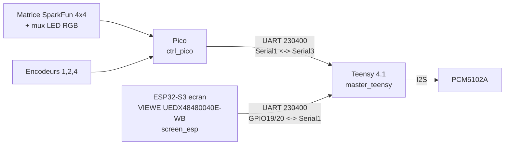

# AZ-2 - Plan de cablage complet (les 3 cartes)

**Etat au 2026-09-13 : son confirme, boutons+encodeurs(1,2,4) confirmes,
ecran+tactile confirmes, tous les liens UART confirmes. Reste a cabler :
mux LED, encodeur 3 (optionnel).**

## Tableau simple (tout, en un coup d'oeil)

| Carte | Signal | GPIO | Va vers | Etat |
| --- | --- | --- | --- | --- |
| Teensy | 3.3V / GND / BCK(21) / LRCK(20) / DIN(7) | - | PCM5102A | **Son confirme** |
| DAC | Jumpers H1L/H2L/H4L | - | Gauche (GND) | **Confirme** (voir AZ2_DAC_PCM5102A.md) |
| DAC | Jumper H3L | - | Droite (3.3V) | **Confirme** |
| DAC | SCK | - | GND (souder direct, pas de fil vers le Teensy) | **Confirme** |
| Teensy | RX1/TX1 | pin 0/1 | ESP32 GPIO19/20 | **Confirme** (HELLO OK) |
| Teensy | RX3/TX3 | pin 15/14 | Pico GPIO0/1 | **Confirme** (HELLO OK) |
| ESP32 (integre) | Tactile SDA/SCL | GPIO40/41 | FT6336U (deja cable usine) | **Confirme**, multi-doigt actif |
| Pico | Colonnes/lignes matrice | GPIO2-9 | Matrice SparkFun | **Confirme** (plusieurs pads testes) |
| Pico | Encodeurs 1, 2, 4 | GPIO15-20, 26-28 | 3x EC11 | **Confirme** (rotation + bouton) |
| Pico | Encodeur 3 | GPIO21/22 | - | Non cable (optionnel, pins libres) |
| Pico | Mux LED S0-S3 + signal | GPIO10-14 | Mux CD74HC4067 | A cabler |
| Mux LED | Canaux 0-11 | - | Anodes RGB (voir AZ2_CABLAGE_PICO.md) | A cabler |
| Toutes cartes | GND | - | Masse commune (etoile recommandee) | Confirme fonctionnel |

## Conseils pour le montage en boitier

- **Masse en etoile** : fais converger tous les fils GND (Teensy, ESP32,
  Pico, DAC, mux) vers un seul point commun (un domino/bornier ou un point
  de soudure central) plutot qu'en chaine -- evite les boucles de masse.
- **Separe l'analogique du numerique** : fais courir les 3 fils I2S vers le
  DAC (BCK/LRCK/DIN) a l'ecart des fils de la matrice/mux qui commutent
  vite (bruit possible sur le son) ; garde-les courts si possible.
- **Teste avant de fermer la boite** : verifie chaque continuite (jumpers
  DAC, GND commun) au multimetre et flashe/reteste chaque carte AVANT de
  visser le capot -- beaucoup plus penible a debugger une fois monte.
- **Accessible depuis l'exterieur du boitier** : les 3 ports USB (ESP32,
  Teensy, Pico -- pour reflasher), le jack de sortie du DAC, et idealement
  un trou pour voir/toucher l'ecran.
- **Alimentation** : chaque carte peut garder son propre port USB pour
  l'instant (simplifie les tests) ; a centraliser sur une seule alim 5V
  plus tard si besoin.

## 0. Alimentation et masses (regle valable partout)

| Rail | Alimente | Note |
| --- | --- | --- |
| 5 V | Ecran (module VIEWE, port USB-C dedie) | Ne jamais faire remonter 5V sur un GPIO |
| 3.3 V | PCM5102A, logique mux, LEDs (via resistances) | Tension logique commune du projet |
| GND commun | ESP32, Teensy, Pico, PCM5102A, matrice, mux | Obligatoire pour tous les liens UART/I2S/scan |

Regle dure: tous les signaux logiques doivent rester en 3.3 V (Teensy 4.x et Pico sont tous les deux natifs 3.3 V, aucun level-shifter necessaire entre eux).

## 1. Teensy 4.1 -> PCM5102A (DAC audio) — CONFIRME, SON OK

| PCM5102A | Teensy 4.1 |
| --- | --- |
| VCC / VIN | 3.3 V |
| GND | GND |
| BCK / BCLK | pin 21 |
| LCK / LRCK / WS | pin 20 (**pas 19**, erreur trouvee et corrigee) |
| DIN | pin 7 |
| SCK | **A GND directement sur la carte DAC** (ni flottant, ni sur une broche Teensy) |

Jumpers de la carte DAC (H1L-H4L) : detail complet et verifie datasheet TI
dans [AZ2_DAC_PCM5102A.md](AZ2_DAC_PCM5102A.md) — H1L/H2L/H4L a gauche
(GND), **H3L seul a droite (3.3V)**. Mettre H4L (FMT) a droite casse le son
(mauvais format audio) : erreur reellement rencontree, a ne pas refaire.

## 2. Teensy 4.1 <-> ESP32-S3 ecran (lien UART "menu/commandes") — CONFIRME

| ESP32-S3 (carte ecran VIEWE) | Teensy 4.1 |
| --- | --- |
| GPIO19 (TX) | pin 0 (RX1) |
| GPIO20 (RX) | pin 1 (TX1) |
| GND | GND |

Debit `230400`, cote Teensy c'est `Serial1`. **Important**: sur cette carte
ecran precise, GPIO1/GPIO2 sont deja pris par l'ecran (R3/R2) — bien
utiliser GPIO19/20, les deux seules broches vraiment libres. Voir
[AZ2_ECRAN_FACADE.md](AZ2_ECRAN_FACADE.md) pour le detail du pourquoi.
Code + cablage confirmes : `HELLO:TEENSY_AUDIO` recu cote ESP32.

## 3. Teensy 4.1 <-> Pico (lien UART "clavier") — CONFIRME

| Pico | Teensy 4.1 |
| --- | --- |
| GPIO0 (TX, `Serial1` par defaut) | pin 14 (RX3) |
| GPIO1 (RX, `Serial1` par defaut) | pin 15 (TX3) |
| GND | GND |

Debit `230400`, cote Teensy c'est `Serial3`. Au boot, le Pico envoie
`HELLO:PICO_KEYPAD`, le Teensy repond `HELLO:TEENSY_AUDIO`.

## 4. Pico -> Matrice de boutons SparkFun 4x4 — CONFIRME

| Fonction | Pico GPIO |
| --- | --- |
| Colonne 0 (pads 0/4/8/12) | GPIO2 |
| Colonne 1 (pads 1/5/9/13) | GPIO3 |
| Colonne 2 (pads 2/6/10/14) | GPIO4 |
| Colonne 3 (pads 3/7/11/15) | GPIO5 |
| Ligne 0 (pads 0/1/2/3) | GPIO6 |
| Ligne 1 (pads 4/5/6/7) | GPIO7 |
| Ligne 2 (pads 8/9/10/11) | GPIO8 |
| Ligne 3 (pads 12/13/14/15) | GPIO9 |

Vraie matrice ligne/colonne (pas 16 boutons independants) : appuyer relie
une ligne a une colonne. Plusieurs pads testes en direct (00, 02, 04, 10,
15) avec DOWN/UP corrects. Detail: [AZ2_CABLAGE_PICO.md](AZ2_CABLAGE_PICO.md#1-matrice-de-boutons-sparkfun-4x4).

## 5. Pico -> Mux LED RGB (CD74HC4067) -> matrice LED — A CABLER

| Fonction | Pico GPIO |
| --- | --- |
| Mux LED S0 | GPIO10 |
| Mux LED S1 | GPIO11 |
| Mux LED S2 | GPIO12 |
| Mux LED S3 | GPIO13 |
| Mux LED signal (entree commune, avec resistance serie) | GPIO14 |

Cablage cote mux -> LED (12 canaux utilises sur 16, canal = couleur\*4 +
ligne) :

| Canal mux | Anode | Canal mux | Anode | Canal mux | Anode |
| --- | --- | --- | --- | --- | --- |
| 0 | Rouge L0 | 4 | Vert L0 | 8 | Bleu L0 |
| 1 | Rouge L1 | 5 | Vert L1 | 9 | Bleu L1 |
| 2 | Rouge L2 | 6 | Vert L2 | 10 | Bleu L2 |
| 3 | Rouge L3 | 7 | Vert L3 | 11 | Bleu L3 |

Les 4 colonnes cathodes sont les MEMES fils que les colonnes boutons
(section 4) — pas de fils supplementaires cote colonnes.

⚠️ Notice SparkFun : erreur de reperage Vert/Bleu inversee sur certains
lots — si les couleurs sortent echangees, inverser ces deux fils. Firmware
pret : un pad presse s'allume tout de suite en blanc (mode test local,
sans besoin du Teensy). Detail complet: [AZ2_CABLAGE_PICO.md](AZ2_CABLAGE_PICO.md#2-leds-rgb-via-multiplexeur-cd74hc4067).

## 6. Pico -> Encodeurs rotatifs — CONFIRME (1, 2, 4), 3 non cable

| Encodeur | A | B | Bouton |
| --- | --- | --- | --- |
| 1 | GPIO15 | GPIO16 | GPIO17 |
| 2 | GPIO18 | GPIO19 | GPIO20 |
| 4 | GPIO26 | GPIO27 | GPIO28 |

Tout en `INPUT_PULLUP`, l'autre patte de chaque contact au GND commun.
Rotation + clic bouton testes et confirmes pour 1, 2 et 4. Encodeur 3 pas
cable (GPIO21/22 libres pour plus tard) — GPIO23/24 a eviter (alim/VBUS de
la Pico). GPIO25 pilote la LED embarquee (clignote en heartbeat visuel).

## 7. Recapitulatif GPIO Pico (24 broches utilisees sur 27 disponibles)

| Usage | GPIO |
| --- | --- |
| UART Teensy | 0, 1 |
| Colonnes matrice | 2, 3, 4, 5 |
| Lignes matrice | 6, 7, 8, 9 |
| Mux LED (S0-S3 + signal) | 10, 11, 12, 13, 14 |
| Encodeur 1 | 15, 16, 17 |
| Encodeur 2 | 18, 19, 20 |
| LED embarquee (heartbeat) | 25 |
| Encodeur 4 | 26, 27, 28 |
| Libres (encodeur 3 futur, ou reserves carte) | 21, 22, 23, 24 |

## 8. Recapitulatif GPIO ESP32-S3 ecran (fixes par la carte, non modifiables)

| Usage | GPIO |
| --- | --- |
| RGB (DE/VSYNC/HSYNC/PCLK) | 18, 17, 16, 21 |
| RGB R0-R4 | 4, 3, 2, 1, 0 |
| RGB G0-G5 | 10, 9, 8, 7, 6, 5 |
| RGB B0-B4 | 15, 14, 13, 12, 11 |
| Backlight | 38 |
| SPI 3 fils (commandes ecran) | CS=39, CLK=48, SDA=47 |
| Tactile I2C | SDA=40, SCL=41 (**confirme, multi-doigt**) |
| SD card (pas encore cable, a reverifier) | CS=47, CLK=45, MOSI=42, MISO=46 |
| UART vers Teensy | **19, 20** (confirme) |

Source: README officiel VIEWE (voir [AZ2_ECRAN_FACADE.md](AZ2_ECRAN_FACADE.md)).

## Etat d'avancement (2026-09-13)

| Liaison | Etat |
| --- | --- |
| Teensy -> PCM5102A | **Son confirme** (Synth_Dexed, note tenue via PAD:NN:DOWN) |
| Ecran ESP32 (affichage + tactile) | **Confirme** : intro, menu navigable au doigt, 2 points de contact |
| UART ESP32 <-> Teensy | **Confirme** (HELLO echange) |
| UART Pico <-> Teensy | **Confirme** (HELLO echange) |
| Boutons Pico (matrice) | **Confirme** (plusieurs pads testes) |
| Encodeurs Pico (1, 2, 4) | **Confirme** (rotation + bouton) |
| Encodeur 3 | Non cable (optionnel) |
| Mux LED Pico | Firmware pret (mode test local inclus), cablage physique a faire |
