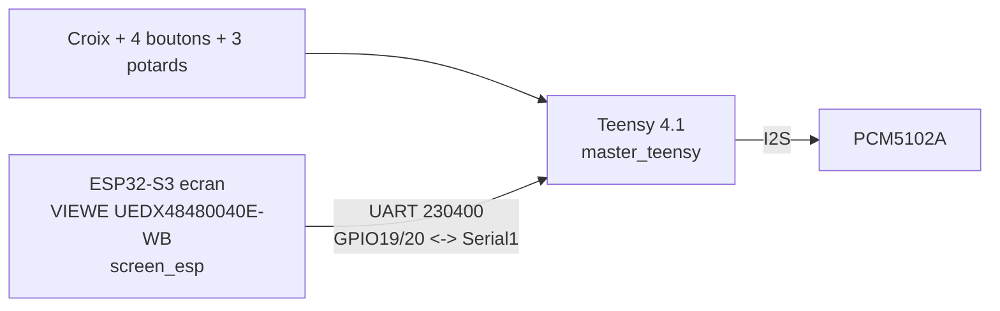

# AZ-2 - Plan de cablage complet (2 cartes : ESP32 ecran + Teensy)

**Etat au 2026-09-15 : son confirme, ecran+tactile confirmes, lien UART
ESP32<->Teensy confirme. Le Pico (3e cerveau clavier) et la matrice
SparkFun 4x4 sont ABANDONNES (voir "Pourquoi le Pico a ete abandonne"
plus bas) -- remplaces par une croix + 4 boutons + 3 potentiometres
cables directement sur le Teensy, a cabler/tester.**

## Tableau simple (tout, en un coup d'oeil)

| Carte | Signal | GPIO | Va vers | Etat |
| --- | --- | --- | --- | --- |
| Teensy | 3.3V / GND / BCK(21) / LRCK(20) / DIN(7) | - | PCM5102A | **Son confirme** |
| DAC | Jumpers H1L/H2L/H4L | - | Gauche (GND) | **Confirme** (voir AZ2_DAC_PCM5102A.md) |
| DAC | Jumper H3L | - | Droite (3.3V) | **Confirme** |
| DAC | SCK | - | GND (souder direct, pas de fil vers le Teensy) | **Confirme** |
| Teensy | RX1/TX1 | pin 0/1 | ESP32 GPIO19/20 | **Confirme** (HELLO OK) |
| ESP32 (integre) | Tactile SDA/SCL | GPIO40/41 | FT6336U (deja cable usine) | **Confirme**, multi-doigt actif |
| Teensy | Croix HAUT/BAS/GAUCHE/DROITE | pin 2/3/4/5 | 4 switches | A cabler |
| Teensy | Boutons A/B/C/D | pin 6/8/9/23 | 4 switches | A cabler |
| Teensy | Potards 1/2/3 | pin 14/15/16 (A0/A1/A2) | 3 potentiometres | A cabler |
| Toutes cartes | GND | - | Masse commune (etoile recommandee) | Confirme fonctionnel |

## Pourquoi le Pico a ete abandonne (2026-09-14/15)

Le Pico + la matrice SparkFun 4x4 + son mux LED CD74HC4067 ont fait
l'objet d'un long diagnostic en direct (broche EN du mux non reliee au
GND -> corrigee ; resistance serie manquante sur SIG -> ajoutee 220Ω ;
masses LED/boutons -> verifiees et pontees correctement ; alimentation
3.3V puis 5V testee) sans jamais obtenir la moindre LED fonctionnelle.
Plutot que de continuer a deviner a distance, la decision a ete prise de
simplifier : plus de 3e carte, plus de matrice/mux, juste des switches et
potentiometres cables directement sur le Teensy (architecture a 2 cartes,
comme a l'origine du projet). Detail complet du diagnostic (utile si on
reprend le sujet un jour) : [AZ2_CABLAGE_PICO.md](AZ2_CABLAGE_PICO.md).
Le code Pico reste dans `src_pico/` pour reference, mais n'est plus
construit par defaut (voir `platformio.ini`, environnement `ctrl_pico`
commente).

Les pins 14/15 du Teensy (ex-`Serial3`, ex-lien UART vers le Pico) sont
maintenant reutilisees comme entrees analogiques (potards 1 et 2).

## Conseils pour le montage en boitier

- **Masse en etoile** : fais converger tous les fils GND (Teensy, ESP32,
  switches, potards) vers un seul point commun (un domino/bornier ou un
  point de soudure central) plutot qu'en chaine -- evite les boucles de
  masse.
- **Separe l'analogique du numerique** : fais courir les 3 fils I2S vers
  le DAC (BCK/LRCK/DIN) a l'ecart des fils des potards (bruit ADC
  possible sur le son) ; garde-les courts si possible.
- **Teste avant de fermer la boite** : verifie chaque continuite (jumpers
  DAC, GND commun) au multimetre et flashe/reteste chaque carte AVANT de
  visser le capot -- beaucoup plus penible a debugger une fois monte.
- **Accessible depuis l'exterieur du boitier** : les 2 ports USB (ESP32,
  Teensy -- pour reflasher), le jack de sortie du DAC, et idealement un
  trou pour voir/toucher l'ecran, plus les switches/potards en facade.
- **Alimentation** : chaque carte peut garder son propre port USB pour
  l'instant (simplifie les tests) ; a centraliser sur une seule alim 5V
  plus tard si besoin.

## 0. Alimentation et masses (regle valable partout)

| Rail | Alimente | Note |
| --- | --- | --- |
| 5 V | Ecran (module VIEWE, port USB-C dedie) | Ne jamais faire remonter 5V sur un GPIO |
| 3.3 V | PCM5102A, logique | Tension logique commune du projet |
| GND commun | ESP32, Teensy, PCM5102A, switches, potards | Obligatoire pour tous les liens UART/I2S/lectures |

Regle dure: tous les signaux logiques doivent rester en 3.3 V (Teensy 4.x
et ESP32-S3 sont tous les deux natifs 3.3 V, aucun level-shifter
necessaire entre eux).

## 1. Teensy 4.1 -> PCM5102A (DAC audio) — CONFIRME, SON OK

| PCM5102A | Teensy 4.1 |
| --- | --- |
| VCC / VIN | 3.3 V |
| GND | GND |
| BCK / BCLK | pin 21 |
| LCK / LRCK / WS | pin 20 (**pas 19**, erreur trouvee et corrigee) |
| DIN | pin 7 |
| SCK | **A GND directement sur la carte DAC** (ni flottant, ni sur une broche Teensy) |

Jumpers de la carte DAC (H1L-H4L) : detail complet et verifie datasheet TI
dans [AZ2_DAC_PCM5102A.md](AZ2_DAC_PCM5102A.md) — H1L/H2L/H4L a gauche
(GND), **H3L seul a droite (3.3V)**. Mettre H4L (FMT) a droite casse le son
(mauvais format audio) : erreur reellement rencontree, a ne pas refaire.

## 2. Teensy 4.1 <-> ESP32-S3 ecran (lien UART "menu/commandes") — CONFIRME

| ESP32-S3 (carte ecran VIEWE) | Teensy 4.1 |
| --- | --- |
| GPIO19 (TX) | pin 0 (RX1) |
| GPIO20 (RX) | pin 1 (TX1) |
| GND | GND |

Debit `230400`, cote Teensy c'est `Serial1`. **Important**: sur cette carte
ecran precise, GPIO1/GPIO2 sont deja pris par l'ecran (R3/R2) — bien
utiliser GPIO19/20, les deux seules broches vraiment libres. Voir
[AZ2_ECRAN_FACADE.md](AZ2_ECRAN_FACADE.md) pour le detail du pourquoi.
Code + cablage confirmes : `HELLO:TEENSY_AUDIO` recu cote ESP32.

## 3. Teensy 4.1 -> Croix + 4 boutons — A CABLER

| Fonction | Teensy pin |
| --- | --- |
| Croix HAUT | 2 |
| Croix BAS | 3 |
| Croix GAUCHE | 4 |
| Croix DROITE | 5 |
| Bouton A | 6 |
| Bouton B | 8 |
| Bouton C | 9 |
| Bouton D | 23 |

Tous en `INPUT_PULLUP` (deja fait dans le firmware,
`setupLocalControls()`), l'autre patte de chaque switch au GND commun.
Protocole envoye : `NAV:<HAUT/BAS/GAUCHE/DROITE>:DOWN`/`UP` pour la croix,
`BTN:<A/B/C/D>:DOWN`/`UP` pour les boutons -- anti-rebond 15ms. Ces memes
switches serviront plus tard de manette pour le mode JEUX (voir
[AZ2_EMULATION_JEUX.md](AZ2_EMULATION_JEUX.md)).

## 4. Teensy 4.1 -> 3 Potentiometres — A CABLER

| Fonction | Teensy pin | Role par defaut |
| --- | --- | --- |
| Potard 1 | 14 (A0) | Volume general (bus d'effets maitre) |
| Potard 2 | 15 (A1) | Reverb (wet) |
| Potard 3 | 16 (A2) | Delay (wet) |

Cablage potentiometre standard : les 2 pattes externes sur 3.3V et GND,
le curseur (patte du milieu) sur la broche Teensy. Protocole envoye :
`POT:<0-2>:<0-127>` (valeur absolue, format compatible MIDI CC), avec
lissage + seuil de variation pour ne pas spammer -- voir
`updatePots()`/`applyMasterMix()` dans `src_teensy/az2_audio/main.cpp`.
Ces 3 potards pilotent DIRECTEMENT le mixeur/bus d'effets deja code
(reverb/delay ajoutes le 2026-09-14) -- pas besoin de l'ESP32 pour que
ca marche, effet immediat.

## 5. Recapitulatif GPIO ESP32-S3 ecran (fixes par la carte, non modifiables)

| Usage | GPIO |
| --- | --- |
| RGB (DE/VSYNC/HSYNC/PCLK) | 18, 17, 16, 21 |
| RGB R0-R4 | 4, 3, 2, 1, 0 |
| RGB G0-G5 | 10, 9, 8, 7, 6, 5 |
| RGB B0-B4 | 15, 14, 13, 12, 11 |
| Backlight | 38 |
| SPI 3 fils (commandes ecran) | CS=39, CLK=48, SDA=47 |
| Tactile I2C | SDA=40, SCL=41 (**confirme, multi-doigt**) |
| SD card (integree a la carte VIEWE) | CS=47, CLK=45, MOSI=42, MISO=46 -- **CS partage avec SPI-SDA de l'ecran (IO47)**, confirme sur le depot officiel VIEWE ; sans risque car l'ecran n'utilise ce bus qu'a l'init (`gfx->begin()`), jamais apres. Firmware pret (`SD.begin()` apres l'ecran), teste sans carte inseree (echec propre, pas de blocage) |
| UART vers Teensy | **19, 20** (confirme) |

Source: README officiel VIEWE (voir [AZ2_ECRAN_FACADE.md](AZ2_ECRAN_FACADE.md)).

## 6. Recapitulatif GPIO Teensy 4.1

| Usage | Pin |
| --- | --- |
| UART ESP32 (Serial1) | 0, 1 |
| Croix (4) | 2, 3, 4, 5 |
| DIN I2S (DAC) | 7 |
| Boutons A/B (2) | 6, 8 |
| Bouton C | 9 |
| Boutons D | 23 |
| Potards 1-3 (A0-A2) | 14, 15, 16 |
| LRCK/BCK I2S (DAC) | 20, 21 |
| Libre (reserve SD/SPI futur) | 10, 11, 12, 13 |

## Etat d'avancement (2026-09-15)

| Liaison | Etat |
| --- | --- |
| Teensy -> PCM5102A | **Son confirme** (Synth_Dexed, note tenue via PAD:NN:DOWN) |
| Ecran ESP32 (affichage + tactile) | **Confirme** : intro, menu navigable au doigt, 2 points de contact |
| UART ESP32 <-> Teensy | **Confirme** (HELLO echange) |
| Croix + 4 boutons (Teensy) | Firmware pret (`NAV:`/`BTN:`), cablage physique a faire |
| 3 potentiometres (Teensy) | Firmware pret (`POT:`, pilote volume/reverb/delay), cablage physique a faire |
| Pico + matrice + mux LED | **Abandonne** (voir "Pourquoi le Pico a ete abandonne") |
