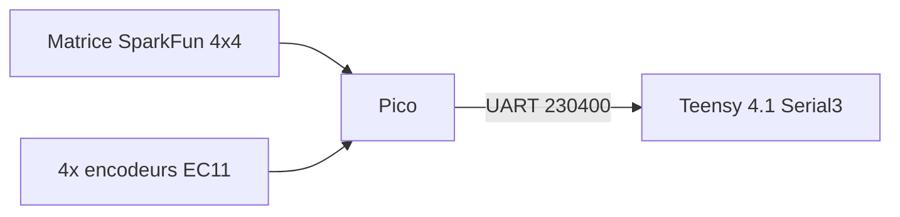

# AZ-2 - Cablage complet du Pico (clavier, LEDs, encodeurs)

Le Pico est le 3e cerveau du projet (decision du 2026-09-13) : le module
ecran ESP32-4848S040C_I n'a presque plus de GPIO libre une fois
ecran+tactile+SD comptes (voir [AZ2_ECRAN_FACADE.md](AZ2_ECRAN_FACADE.md)),
donc tout le clavier physique (matrice SparkFun 4x4, LEDs, 4 encodeurs) est
scanne par un Pico dedie, qui parle directement au Teensy en UART. Le Pico a
26 GPIO utilisables et aucune contrainte: **pas besoin de multiplexeur pour
la v0** (boutons + LED une seule couleur).

Firmware: `src_pico/main.cpp`, environnement PlatformIO `ctrl_pico`.
**Compile, flashe et teste en conditions reelles (2026-09-13)** : boutons,
LED (mode test local) et encodeurs 1/2/4 tous confirmes fonctionnels.

## Vue d'ensemble

## Pourquoi pas de multiplexeur ici

La matrice SparkFun 4x4 est une VRAIE matrice ligne/colonne (4 lignes + 4
colonnes electriques, pas 16 boutons independants) : appuyer sur un pad
relie sa ligne a sa colonne. Scanner une matrice 4x4 ne demande que 4 sorties
(colonnes) + 4 entrees (lignes) = 8 broches — le Pico en a largement assez,
un CD74HC4067 ne serait utile que si on manquait de GPIO (ce qui est le cas
sur l'ESP32-ecran, pas ici).

## 1. Matrice de boutons (SparkFun 4x4)

| Fonction | Pico GPIO | Type |
| --- | --- | --- |
| Colonne 0 (COL_0, pads 0/4/8/12) | GPIO2 | Sortie (drive LOW pour scanner) |
| Colonne 1 (COL_1, pads 1/5/9/13) | GPIO3 | Sortie |
| Colonne 2 (COL_2, pads 2/6/10/14) | GPIO4 | Sortie |
| Colonne 3 (COL_3, pads 3/7/11/15) | GPIO5 | Sortie |
| Ligne 0 (ROW_0, pads 0/1/2/3) | GPIO6 | Entree (`INPUT_PULLUP`) |
| Ligne 1 (ROW_1, pads 4/5/6/7) | GPIO7 | Entree (`INPUT_PULLUP`) |
| Ligne 2 (ROW_2, pads 8/9/10/11) | GPIO8 | Entree (`INPUT_PULLUP`) |
| Ligne 3 (ROW_3, pads 12/13/14/15) | GPIO9 | Entree (`INPUT_PULLUP`) |

**Principe de scan** (deja code dans `scanMatrix()`): le firmware met une
colonne a LOW (les 3 autres en haute impedance), lit les 4 lignes — une
ligne a LOW = le bouton (ligne, colonne) est appuye — puis passe a la
colonne suivante. Anti-rebond 12 ms + evenement `HOLD` apres 600 ms
d'appui continu, comme sur le prototype ESP32 deja teste.

**A verifier sur la carte SparkFun physique** avant de souder: fait
correspondre ces 8 fils avec le detrompage du guide SparkFun
(https://learn.sparkfun.com/tutorials/button-pad-hookup-guide/all) — les
"colonnes" y sont les cathodes LED communes, pas des vrais GND, donc bien
suivre le sens indique par le guide plutot que de deviner via un
multimetre en mode continuite seul.

## 2. LEDs RGB (via multiplexeur CD74HC4067)

D'apres la notice officielle SparkFun
(https://learn.sparkfun.com/tutorials/button-pad-hookup-guide/all) : "les
LED sont montees comme trois matrices 4x4 superposees, une par couleur" —
4 colonnes cathodes COMMUNES (les memes que les boutons, section 1) + 12
lignes d'anode (4 lignes x 3 couleurs). Avec un CD74HC4067 (16 voies) sur
les 12 lignes d'anode, on adresse chaque combinaison couleur/ligne avec 4
lignes de selection + 1 signal, au lieu de 12 fils directs.

| Fonction | Pico GPIO | Type |
| --- | --- | --- |
| Mux LED S0 | GPIO10 | Sortie |
| Mux LED S1 | GPIO11 | Sortie |
| Mux LED S2 | GPIO12 | Sortie |
| Mux LED S3 | GPIO13 | Sortie |
| Mux LED signal (entree commune) | GPIO14 | Sortie (avec resistance serie) |

**Broche EN (enable) du mux -- PAS reliee a une GPIO, mais indispensable** :
le CD74HC4067 a une broche EN active a l'etat BAS. Si elle est laissee en
l'air (non connectee), le mux entier reste desactive en permanence -- AUCUN
canal ne passe jamais, quel que soit ce que S0-S3/SIG font. Symptome
observe reellement (2026-09-14) : zero LED sur les 48 combinaisons
colonne x canal testees en mode `LEDTEST`, alors que boutons et
alimentation du mux (3V, dans la plage 2-6V du CD74HC4067) etaient
corrects. **La broche EN doit etre reliee au GND commun** (celui du Pico
et de la matrice LED), pas a une sortie du Pico.

**Cablage cote mux -> LED** : canal = `couleur*4 + ligne`, couleur 0=rouge,
1=vert, 2=bleu (a confirmer sur ta carte : la notice SparkFun signale une
erreur de reperage Vert/Bleu inversee sur certains lots — si les couleurs
sortent echangees a l'usage, c'est probablement ca, inverse juste les deux
fils).

| Canal mux | Anode |
| --- | --- |
| 0-3 | Rouge, lignes 0-3 |
| 4-7 | Vert, lignes 0-3 |
| 8-11 | Bleu, lignes 0-3 |
| 12-15 | inutilises |

**Important (courant)** : le CD74HC4067 est un commutateur analogique, pas
un vrai driver de courant — une resistance serie sur la ligne "signal" est
indispensable, et n'allumer qu'un canal a la fois (ce que fait deja le
firmware) reste plus sur que d'en cumuler plusieurs simultanement. Voir
aussi [AZ2_CABLAGE_BASE.md](AZ2_CABLAGE_BASE.md#multiplexeurs--drivers-facade).

**Principe d'affichage**: pour chaque colonne active, le firmware pulse
(quelques dizaines de us) le canal mux de chaque ligne/couleur qui doit
s'allumer dans cette colonne, puis passe a la colonne suivante — balayage
colonne x couleur x ligne, persistance retinienne (POV) comme le v0 mono,
mais capable d'afficher les 3 couleurs.

Deux sources pour la couleur affichee (voir `effectiveColorMask()` dans le
firmware) :
- **Test local** : un pad physiquement presse s'allume tout de suite en
  blanc, meme sans Teensy branche -- prioritaire sur tout le reste.
- **Etat musical** : sinon, la derniere confirmation du Teensy
  (`LED:NN:ON`/`OFF`) reste affichee. Le protocole AZ2 actuel ne transporte
  pas encore de couleur : `ON` allume les 3 couleurs (blanc) pour
  l'instant, a affiner plus tard (rouge=mute, vert=play...).

## 3. Encodeurs rotatifs (1, 2, 4 cables -- 3 retire pour l'instant)

EC11 classiques (2 voies quadrature A/B + bouton poussoir integre), tout en
`INPUT_PULLUP` (l'autre patte de chaque contact va au GND commun).

| Encodeur | A | B | Bouton |
| --- | --- | --- | --- |
| 1 | GPIO15 | GPIO16 | GPIO17 |
| 2 | GPIO18 | GPIO19 | GPIO20 |
| 4 | GPIO26 | GPIO27 | GPIO28 |

Encodeur 3 retire du firmware pour l'instant (pas cable) : GPIO21/22/25
restent libres, faciles a le rebrancher plus tard (voir commentaire dans
`src_pico/main.cpp`). Le numero "3" est saute plutot que renomme -- on
garde le meme numero par encodeur physique.

Protocole envoye vers le Teensy: `MACRO:<n>:+N` / `MACRO:<n>:-N` par cran
(4 transitions quadrature = 1 cran), `ENC:<n>:BTN:DOWN`/`UP` pour le clic.
L'encodeur 1 pilote reellement le transpose audio cote Teensy (+/-24
demi-tons) ; 2 et 4 sont juste relayes/affiches pour l'instant.

GPIO23/24 a eviter si on rebranche l'encodeur 3 ou qu'on en ajoute un (23 =
mode alim SMPS, 24 = detection VBUS) — risque electrique/fonctionnel reel
si reutilises.

### LED embarquee (test visuel sans port serie)

GPIO25 (LED verte de la Pico, libre depuis le retrait de l'encodeur 3)
clignote 2x/seconde des que le firmware tourne (`heartbeat()`), independant
de tout cablage externe. Utile pour verifier d'un coup d'oeil que le Pico
est vivant sans avoir besoin d'un ordinateur branche.

## 4. Liaison UART vers le Teensy

| Pico | Teensy 4.1 |
| --- | --- |
| GPIO0 (TX, `Serial1` par defaut) | pin 14 (RX3) |
| GPIO1 (RX, `Serial1` par defaut) | pin 15 (TX3) |
| GND | GND |

Debit: `230400`. Cote Teensy, c'est `Serial3` (voir
`src_teensy/az2_audio/main.cpp`) — un port different de celui utilise par
l'ESP32-ecran (`Serial1`, pins 0/1), pour que les deux cartes puissent
parler au Teensy sans se marcher dessus.

Au boot, le Pico envoie `HELLO:PICO_KEYPAD` ; le Teensy repond
`HELLO:TEENSY_AUDIO` sur les trois liaisons (USB, ESP32, Pico).

## 5. Recapitulatif des broches Pico utilisees

| Usage | GPIO |
| --- | --- |
| UART Teensy | 0, 1 |
| Colonnes matrice | 2, 3, 4, 5 |
| Lignes matrice | 6, 7, 8, 9 |
| Mux LED (S0-S3 + signal) | 10, 11, 12, 13, 14 |
| Encodeur 1 | 15, 16, 17 |
| Encodeur 2 | 18, 19, 20 |
| LED embarquee (heartbeat visuel) | 25 |
| Encodeur 4 | 26, 27, 28 |
| Libres (encodeur 3 pas cable, reserves carte) | 21, 22, 23, 24 |

24 broches utilisees sur 27 vraiment disponibles (GPIO23/24 exclus) : 3
libres (21, 22 pour un futur encodeur 3, plus 23/24 non recommandes).

## Tests -- deroule reel (2026-09-13)

1. Flasher `ctrl_pico` (`pio run -e ctrl_pico -t upload`). **Fait.**
2. Verifier au moniteur serie (USB, 230400 bauds): `AZ2:ROLE:PICO_KEYPAD`,
   `AZ2:FEATURE:SPARKFUN_4X4_MATRIX`, `AZ2:FEATURE:LED_RGB_MUX`,
   `AZ2:FEATURE:ENCODERS_4X`, puis heartbeat `STATUS:PICO_KEYPAD:READY`.
   **Fait**, plus la LED embarquee qui clignote (voir section 3).
3. Cabler la matrice (section 1), tester chaque bouton: `PAD:00` a `PAD:15`
   doivent apparaitre en `DOWN`/`UP` au moniteur serie. **Fait et
   confirme** (plusieurs pads testes en direct).
4. Cabler le mux LED (section 2), verifier qu'une LED blanche s'allume au
   bon endroit des qu'on presse son bouton (mode test local, pas besoin du
   Teensy) -- ou, plus fiable, utiliser la commande serie `LEDTEST` (voir
   `src_pico/main.cpp`) qui maintient un seul canal allume ~0,7s a la fois
   au lieu du POV rapide normal. Si une couleur manque ou est echangee
   avec une autre, verifier l'errata Vert/Bleu de la notice SparkFun
   (section 2). **Diagnostique le 2026-09-14** : zero LED sur les 48
   combinaisons testees (mode `LEDTEST`) malgre boutons et alimentation
   mux corrects (3V, dans la plage 2-6V) -- cause identifiee : broche EN
   du mux laissee en l'air (voir section 2). Correction (EN -> GND
   commun) en cours de cablage, pas encore reverifiee.
5. Cabler un encodeur a la fois (section 3), verifier `MACRO:n:+1`/`-1` par
   cran et `ENC:n:BTN:DOWN`/`UP` au clic. **Fait et confirme** pour les
   encodeurs 1, 2 et 4.
6. Cabler l'UART vers le Teensy (section 4) une fois celui-ci flashe et
   verifier `HELLO:TEENSY_AUDIO` en retour.
