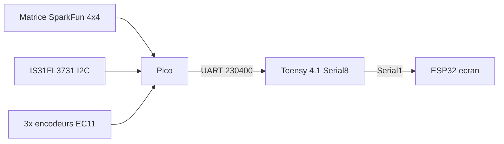

# AZ-2 — Câblage Pico v2 — ARCHIVÉ, NE PAS UTILISER

> **Cette proposition est annulée.** Le Button Pad SparkFun et le module
> IS31FL3731 ne sont pas intégrés à l'AZ-2. Ce document est conservé comme
> trace d'analyse uniquement ; il ne décrit pas le câblage actuel.

Date : 26 septembre 2026. Reprend le projet documenté dans
[AZ2_CABLAGE_PICO.md](AZ2_CABLAGE_PICO.md) (abandonné le 15/09 uniquement à
cause du multiplexeur LED CD74HC4067, jamais fonctionnel malgré un long
diagnostic — EN non relié, résistance série manquante, masses vérifiées,
zéro LED sur les 48 combinaisons testées). **Tout le reste de la v1
marchait déjà et n'a pas besoin d'être refait** : le scan de la matrice de
boutons (8 broches, aucun composant externe) et les encodeurs rotatifs
étaient confirmés fonctionnels en test réel le 13/09.

## Ce qui change par rapport à la v1

- **LED : IS31FL3731 au lieu du CD74HC4067.** Le CD74HC4067 est un simple
  commutateur analogique (pas un driver LED) détourné de son usage — d'où
  la panne EN/résistance jamais vraiment résolue. L'IS31FL3731 est un vrai
  driver de matrice LED PWM en I2C (9 lignes CS / 16 lignes SW, jusqu'à
  144 LED simple-couleur), pensé exactement pour une matrice cathode
  commune comme celle du bouton-pad SparkFun (4 colonnes cathodes + 12
  lignes anode = 4 lignes × 3 couleurs) — branchement direct, pas de
  résistance série à calculer, pas de broche EN à ne pas oublier.
- **Les 3 encodeurs quittent le Teensy pour le Pico** (demande du
  26/09, "on a assez de place") — la v1 n'en avait câblé que 2+1 (le 3e
  jamais câblé, GPIO21/22/25 réservés). Cette fois les 3 sont prévus dès
  le départ.
- **Liaison Teensy** : la v1 utilisait `Serial3` (pins 14/15) — **ces pins
  sont maintenant prises par l'Encodeur 1** (CLK/DT, voir
  AZ2_CABLAGE_MASTER.md section 4). Cette v2 utilise **`Serial8`
  (pins 34/35)**, seule paire de broches UART matérielle du Teensy 4.1
  encore totalement libre (Serial7/pins 28-29 est déjà pris par le rack
  externe — voir `Serial7` dans `src_teensy/az2_audio/main.cpp`).

## Vue d'ensemble

Le Pico ne parle **qu'au Teensy** (comme la v1) — pas de lien direct
Pico↔ESP32. Le Teensy relaie ensuite vers l'écran exactement comme il le
fait déjà pour ses propres croix/boutons/encodeurs actuels (mêmes messages
`NAV:`/`BTN:`/`TURN:`/`ENC:` réémis sur `Serial1`, voir
`handleTeensyLine()` côté ESP32 — aucun changement requis côté écran).

## 1. Matrice de boutons (SparkFun 4x4) — inchangé depuis la v1, déjà confirmé

| Fonction | Pico GPIO | Type |
| --- | --- | --- |
| Colonne 0 (pads 0/4/8/12) | GPIO2 | Sortie |
| Colonne 1 (pads 1/5/9/13) | GPIO3 | Sortie |
| Colonne 2 (pads 2/6/10/14) | GPIO4 | Sortie |
| Colonne 3 (pads 3/7/11/15) | GPIO5 | Sortie |
| Ligne 0 (pads 0/1/2/3) | GPIO6 | Entrée `INPUT_PULLUP` |
| Ligne 1 (pads 4/5/6/7) | GPIO7 | Entrée `INPUT_PULLUP` |
| Ligne 2 (pads 8/9/10/11) | GPIO8 | Entrée `INPUT_PULLUP` |
| Ligne 3 (pads 12/13/14/15) | GPIO9 | Entrée `INPUT_PULLUP` |

Scan colonne par colonne (LOW), lecture des 4 lignes, anti-rebond 12ms —
déjà testé et confirmé le 13/09, aucune raison de s'attendre à un problème
ici. Rappel du guide SparkFun : les "colonnes" de la matrice sont en réalité
les cathodes communes des LED, pas de vrais GND — suivre le détrompage du
[guide officiel](https://learn.sparkfun.com/tutorials/button-pad-hookup-guide/all)
plutôt que deviner au multimètre.

## 2. LEDs RGB — IS31FL3731 (remplace le mux CD74HC4067)

Câblage **direct**, sans résistance ni broche EN à gérer (le chip gère son
propre courant constant en interne) :

| Fonction | IS31FL3731 | Va vers |
| --- | --- | --- |
| VCC | - | 3.3V |
| GND | - | Masse commune |
| SDA | - | Pico GPIO20 (I2C1 SDA) |
| SCL | - | Pico GPIO21 (I2C1 SCL) |
| ADDR | - | GND (adresse I2C par défaut ; laisser flottant ou relier à 3.3V si collision avec un autre périphérique I2C) |
| CS0-CS3 (colonnes) | - | Les 4 cathodes communes de la matrice LED (mêmes fils électriques que les colonnes boutons, section 1 — vérifier sur la notice SparkFun si le connecteur LED est bien séparé du connecteur boutons malgré le partage électrique) |
| SW0-SW11 (lignes/couleur) | - | Les 12 anodes (4 lignes × rouge/vert/bleu) |

Une seule adresse I2C, un seul chip suffit (16×9 = 144 LED mono max, on
n'utilise que 4×12 = 48 ici). Librairie : `Adafruit_IS31FL3731` (dispo via
PlatformIO/Arduino Library Manager) gère nativement l'adressage
CS/SW — pas besoin de piloter les registres à la main.

**Erratum connu (notice SparkFun)** : Vert/Bleu parfois inversés selon le
lot — si les couleurs sortent échangées, inverser les deux fils
correspondants plutôt que de chercher un bug logiciel.

## 3. Encodeurs rotatifs (les 3, tous sur le Pico cette fois)

EC11 classiques, `INPUT_PULLUP`, autre patte au GND commun :

| Encodeur | CLK | DT | SW (bouton) |
| --- | --- | --- | --- |
| Encodeur 1 (Volume) | GPIO15 | GPIO16 | GPIO17 |
| Encodeur 2 (Reverb) | GPIO10 | GPIO11 | GPIO12 |
| Encodeur 3 (Delay) | GPIO26 | GPIO27 | GPIO28 |

Protocole vers le Teensy : garder **exactement** `POT:<0-2>:<0-127>` (rotation)
et `ENC:<0-2>:DOWN/UP` (bouton) — même format que ce que le Teensy reçoit
déjà de ses propres broches aujourd'hui, pour que `updateEncoders()`/
`updateEncoderButtons()` côté Teensy n'aient quasiment rien à changer (la
source de l'évènement change, pas sa forme).

## 4. Liaison UART vers le Teensy

| Pico | Teensy 4.1 |
| --- | --- |
| GPIO0 (TX, UART0 par défaut) | pin 35 (RX8) |
| GPIO1 (RX, UART0 par défaut) | pin 34 (TX8) |
| GND | GND |

Débit `230400` (identique v1). Côté Teensy : **`Serial8`**, pas `Serial3`
(pris par l'Encodeur 1 dans l'architecture actuelle à 2 cartes — voir plus
haut). Au boot, le Pico envoie `HELLO:PICO_KEYPAD` ; le Teensy répond
`HELLO:TEENSY_AUDIO` sur toutes ses liaisons (USB, ESP32 Serial1, Pico
Serial8), même convention que le lien ESP32 existant.

## 5. Récapitulatif des broches Pico

| Usage | GPIO |
| --- | --- |
| UART Teensy (Serial8) | 0, 1 |
| Colonnes matrice boutons | 2, 3, 4, 5 |
| Lignes matrice boutons | 6, 7, 8, 9 |
| Encodeur 2 (CLK/DT/SW) | 10, 11, 12 |
| Encodeur 1 (CLK/DT/SW) | 15, 16, 17 |
| I2C1 vers IS31FL3731 (SDA/SCL) | 20, 21 |
| LED embarquée (heartbeat) | 25 |
| Encodeur 3 (CLK/DT/SW) | 26, 27, 28 |
| Libres | 13, 14, 18, 19, 22, 23, 24 |

19 broches utilisées sur 26 disponibles — large marge, cohérent avec "si on
a assez de place" (largement le cas).

## 6. Côté Teensy : ce qui doit changer

Contrairement à la matrice/LED/encodeurs (tout côté Pico, code neuf dans un
futur `src_pico/`), le Teensy a un vrai changement d'architecture à faire
une fois ce câblage en place :

1. Ouvrir `Serial8` (`Serial8.begin(230400)`), lire ses lignes comme
   `Serial1` l'est déjà pour l'ESP32.
2. **Ne plus lire les broches locales 2-5/6,8,9,23/14-19,22,24,25 pour
   croix/boutons/encodeurs** — ces fonctions arrivent maintenant par
   `Serial8` (`NAV:`/`BTN:`/`POT:`/`ENC:`) au lieu de `setupLocalControls()`
   qui les lisait directement en GPIO.
3. Relayer ces mêmes messages vers l'ESP32 (`Serial1`) exactement comme
   aujourd'hui — l'écran ne voit aucune différence.
4. Envoyer en retour les confirmations d'état (LED à allumer/éteindre par
   pad, si un protocole `LED:` existe déjà côté musical — sinon à créer)
   vers `Serial8` pour que le Pico sache quoi afficher sur l'IS31FL3731.

**Pas encore fait** — c'est l'étape suivante une fois ce plan de câblage
validé/soudé. Prévoir de garder `setupLocalControls()` en secours
(`#ifdef`) le temps de valider le nouveau chemin, plutôt que de supprimer
le câblage direct avant d'être sûr que le Pico fonctionne en conditions
réelles (même prudence que pour tout changement qui touche la production).

## 7. Déroulé de test conseillé (reprend la méthode qui a marché le 13/09)

1. Câbler et tester la matrice de boutons SEULE d'abord (section 1) —
   déjà validée en v1, devrait remarcher à l'identique.
2. Câbler et tester l'IS31FL3731 seul (section 2), avec la lib Adafruit,
   AVANT de brancher le Teensy — vérifier qu'on peut allumer chaque
   LED/couleur individuellement depuis le moniteur série du Pico.
3. Câbler et tester les 3 encodeurs un par un (section 3).
4. Câbler la liaison `Serial8` (section 4), vérifier le `HELLO:` en retour.
5. Seulement APRÈS ces 4 étapes validées séparément : faire le changement
   côté Teensy (section 6).
