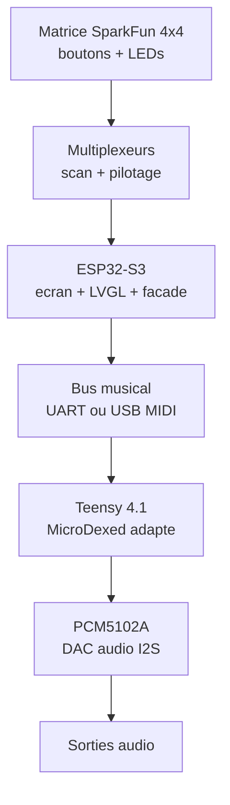
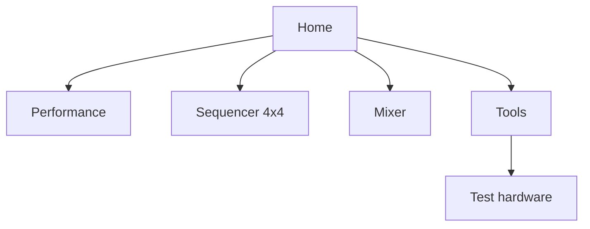

# AZ-2 - Lignes ecran, facade et groovebox

Objectif: figer une premiere direction claire pour AZ-2: une groovebox hardware basee sur Teensy pour l'audio adapte de MicroDexed-touch, un ecran ESP32-S3 pour l'interface, et une matrice SparkFun 4x4 bouton + LED lue/pilotee par l'ESP32 avec multiplexeurs.

**[Note 2026-09-17]** Document de planification TRES precoce, perime
sur plusieurs points cles : la matrice SparkFun 4x4+LED a ete
abandonnee le 2026-09-14 (remplacee par croix+boutons+encodeurs
directs sur le Teensy) ; l'ecran reellement utilise est le module
VIEWE UEDX48480040E-WB (driver GC9503V), pas l'ESP32-4848S040C_I/ST7701
suppose au depart (identifie le 2026-09-13, voir `platformio.ini`).
Etat reel : [AZ2_ETAT_DES_LIEUX.md](AZ2_ETAT_DES_LIEUX.md).

Voir aussi: [Strategie de portage MicroDexed-touch](AZ2_PORTAGE_MICRODEXED_TOUCH.md).

## Vision produit

AZ-2 doit se comporter comme un instrument autonome:

- Teensy = moteur musical temps reel derive de MicroDexed-touch.
- PCM5102A = DAC audio stereo I2S principal.
- ESP32-S3 + ecran = cockpit visuel, menus, sequenceur, mixer, outils.
- Matrice SparkFun 4x4 bouton + LED = pads, steps, scenes, mutes, navigation performative.
- Multiplexeurs = lecture/pilotage propre de la matrice sans gaspiller les GPIO.

Decision de base: l'ecran, le clavier 4x4 et les LEDs de la matrice sont geres par l'ESP32-S3. Le Teensy ne gere pas l'UI, il joue et reste stable.

## Ecran retenu

Documents fournis au depart: `ESP32-4848S040 Specifications-EN.pdf` et
`Getting started 4.0 Inch.pdf`. **Identite reelle confirmee le 2026-09-13**
en lisant l'etiquette sur le flex de l'ecran physique: c'est un
**VIEWE UEDX48480040E-WB-V1.3**, pas le "ESP32-4848S040C_I / ST7701"
generique suppose au depart — meme forme/resolution, mais driver LCD et
brochage differents. Depot officiel du fabricant (source de verite pour le
cablage) :
https://github.com/VIEWESMART/UEDX48480040ESP32-4inch-Touch-Display

| Point | Valeur confirmee | Note projet |
| --- | --- | --- |
| Module | VIEWE UEDX48480040E-WB-V1.3 | Module ecran ESP32-S3 integre |
| MCU | ESP32-S3 | Wi-Fi, Bluetooth, double coeur |
| PSRAM | 8 MB | Important pour UI et buffers graphiques |
| Flash | 16 MB | Correct pour firmware UI + assets raisonnables |
| Taille ecran | 4.0 pouces | Format carre, bon pour groovebox compacte |
| Resolution | 480 x 480 px | UI carree, grille 4x4 naturelle |
| Driver LCD | **GC9503V** (pas ST7701) | `gc9503v_type1_init_operations` dans Arduino_GFX |
| Tactile | I2C, SDA=IO40, SCL=IO41 | Pas encore cable/teste |
| Stockage | TF card (SPI: CS=47, CLK=45, MOSI=42, MISO=46 - a reverifier) | Presets, assets UI, sauvegardes possibles |

Regle electrique: alimenter le module comme prevu en 5 V, mais ne jamais envoyer de 5 V sur les GPIO. Les signaux logiques doivent rester en 3.3 V.

### Pinout RGB confirme (README officiel VIEWE, "PinOverview")

| Signal | GPIO | Signal | GPIO | Signal | GPIO |
| --- | --- | --- | --- | --- | --- |
| DE | 18 | G0 | 10 | B0 | 15 |
| VSYNC | 17 | G1 | 9 | B1 | 14 |
| HSYNC | 16 | G2 | 8 | B2 | 13 |
| PCLK | 21 | G3 | 7 | B3 | 12 |
| R0 | 4 | G4 | 6 | B4 | 11 |
| R1 | 3 | G5 | 5 | Backlight | 38 |
| R2 | 2 | | | SPI CS/SCK/SDA | 39/48/47 |
| R3 | 1 | | | | |
| R4 | 0 | | | | |

Firmware de test valide (2026-09-13): `src_esp32/az2_screen/main.cpp`,
environnement PlatformIO `screen_esp`. Ecran allume, "AZ-2" affiche, carre
de couleur qui tourne — confirme par test reel sur la carte.

## DAC audio

MicroDexed-touch utilise un `PCM5102A Audio Board` comme DAC audio avec la configuration `I2S_AUDIO_ONLY`.

| Point | Direction AZ-2 |
| --- | --- |
| DAC principal | PCM5102A ou module I2S compatible |
| Connexion | I2S depuis Teensy vers DAC: BCLK 21, LRCLK 20, DIN 7 |
| Role | Conversion audio stereo principale, pas audio UI |
| Mute | Utiliser `PCM5102_MUTE_PIN` si le pin XSMT est cable |
| Sortie | Niveau ligne 2.1 VRMS, pas ampli casque direct |
| Alimentation | 3.3 V, logique 3.3 V |

MicroDexed-touch contient aussi un `MCP4728`, mais celui-ci sert au CV/controle analogique 4 canaux. Il est optionnel pour AZ-2 et ne remplace pas le DAC audio PCM5102A.

## Architecture fonctionnelle

Le Pico RP2040 devient optionnel. Il peut servir plus tard si on ajoute beaucoup de LEDs, encodeurs, faders ou une matrice plus grande, mais il n'est pas dans la ligne principale actuelle.

## Ligne physique de facade

L'ecran carre donne une vraie logique: la grille 4x4 physique et l'interface 480x480 peuvent se repondre visuellement.

| Zone | Placement | Role |
| --- | --- | --- |
| Ecran 4 pouces 480x480 | Centre haut | Pattern, mixer, patch, navigation |
| Encodeurs 1-4 | Sous l'ecran | Parametres contextuels visibles sur la derniere ligne UI |
| Matrice SparkFun 4x4 bouton + LED | Bas de facade | Steps, pads, scenes, mutes, selection pattern |
| Transport | Bas droit ou tranche basse | Play, Stop, Rec, Tap tempo |
| Boutons systeme | Cote gauche/droit de l'ecran | Home, Back, Shift, Menu |
| TF accessible | Tranche du boitier | Presets, samples courts, assets, backup |
| USB-C | Tranche du boitier | Alimentation, flash, MIDI/serial selon mode |

## Matrice SparkFun 4x4 + multiplexeurs

La matrice SparkFun 4x4 est la surface de jeu principale. L'ESP32 doit scanner les boutons, piloter les LEDs, puis envoyer seulement les evenements musicaux utiles au Teensy.

Le guide SparkFun precise que la carte est une matrice boutons + LEDs RGB: les LEDs partagent des cathodes communes par colonnes, avec trois matrices couleur superposees. Pour le premier prototype, on teste d'abord les boutons et une seule couleur LED avant de faire le RGB complet.

| Fonction | Gere par | Direction |
| --- | --- | --- |
| Scan boutons 4x4 | ESP32-S3 | Lire et anti-rebondir localement |
| LEDs de pads | ESP32-S3 | Afficher steps actifs, piste, mode, mute/solo |
| Multiplexeurs | ESP32-S3 | Economiser les GPIO et organiser le cablage |
| Evenements musicaux | ESP32-S3 -> Teensy | `PAD`, `STEP`, `TRANSPORT`, `MACRO` |
| Son | Teensy | Ne jamais dependre du rafraichissement ecran |

### Regles de scan

- Scanner vite, mais envoyer seulement les changements d'etat: down, up, hold.
- Faire l'anti-rebond cote ESP32 avant d'envoyer au Teensy.
- Garder une table `pad_id` de 0 a 15, stable dans tout le projet.
- Ne pas faire transiter les etats LED par le Teensy sauf si l'etat vient du moteur audio.
- Prevoir un mode test hardware qui allume chaque LED quand son bouton est presse.

### Mapping pad_id

| Ligne | Pads |
| --- | --- |
| Ligne 1 | 0, 1, 2, 3 |
| Ligne 2 | 4, 5, 6, 7 |
| Ligne 3 | 8, 9, 10, 11 |
| Ligne 4 | 12, 13, 14, 15 |

## Mapping musical 4x4

Premier mapping simple, adapte a une groovebox.

| Mode | Ligne 1 | Ligne 2 | Ligne 3 | Ligne 4 |
| --- | --- | --- | --- | --- |
| Step Sequencer | Steps 1-4 | Steps 5-8 | Steps 9-12 | Steps 13-16 |
| Drum Pad | Kick / Snare / Hat / Clap | Perc 1-4 | FX 1-4 | Scene 1-4 |
| Mixer | Mute 1-4 | Solo 1-4 | Select track 1-4 | Scene 1-4 |
| Navigation | Pages rapides | Banques | Patterns | Confirm/Cancel/Shift/Menu |

Le tactile peut selectionner des menus, mais les actions musicales rapides doivent rester sur boutons physiques.

## Lignes UI sur l'ecran

Pour 480x480, on pense en blocs carres et lisibles.

### Ecran type: Performance

| Ligne | Hauteur approx. | Contenu |
| --- | ---: | --- |
| Status | 32 px | AZ-2, BPM, MIDI, CPU/audio, alimentation |
| Mode | 48 px | DX, Drum, Sample, Mixer, Seq, Tools |
| Corps | 280 px | Grille 4x4, piste active, pattern, macros |
| Encodeurs | 64 px | E1-E4 + nom + valeur courte |
| Soft keys | 56 px | SAVE, LOAD, FX, ROUTE ou actions page |

### Navigation cible

## Contrat ESP32 vers Teensy

L'ESP32 transforme les gestes UI en messages musicaux. Le Teensy repond avec son et etat machine.

| Source | Destination | Message | Exemple |
| --- | --- | --- | --- |
| ESP32 | Teensy | Pad appuye | `PAD:07:DOWN:vel=110` |
| ESP32 | Teensy | Pad relache | `PAD:07:UP` |
| ESP32 | Teensy | Step toggle | `STEP:track=2,step=11,on=1` |
| ESP32 | Teensy | Macro encodeur | `MACRO:1:+3` |
| ESP32 | Teensy | Transport | `PLAY`, `STOP`, `REC:TOGGLE` |
| Teensy | ESP32 | Etat audio | `BPM:128`, `CPU:42`, `CLIP:0` |
| Teensy | ESP32 | Etat pattern | `PATTERN:A03`, `TRACK:2`, `STEP:11:on` |
| Teensy | ESP32 | Etat LED musical | `LED:11:ON`, `LED:02:BLINK` |

## Regles de design

- Le Teensy garde la priorite audio. Aucun menu ESP32 ne doit bloquer le son.
- Le clavier 4x4 est l'organe de jeu principal, pas un simple menu.
- Les LEDs de pads doivent donner l'etat musical en un regard.
- Les encodeurs doivent toujours avoir un label visible a l'ecran.
- Une page = une fonction forte: sequenceur, mixer, performance, tools.
- Le tactile est utile pour regler, pas pour jouer vite.
- Retro-Go ou jeux restent optionnels et isoles du moteur musical.
- Le driver ST7701 doit etre valide sur ce module avant de construire toute l'UI definitive.

## Prochaine passe technique

1. Valider le module PCM5102A: brochage, alim, pin XSMT/mute si disponible.
2. Identifier les multiplexeurs disponibles: reference, nombre de voies, usage bouton ou LED.
3. Choisir le bus ESP32 -> Teensy: UART serie simple au debut, USB MIDI plus tard si besoin.
4. Definir le cablage de la matrice SparkFun 4x4: lignes, colonnes, LEDs, anti-rebond.
5. Creer `lib/AZ2_Protocol.h` pour les messages ESP32/Teensy.
6. Faire un prototype ESP32: LVGL 480x480 + scan 4x4 + test LEDs + page test hardware.
7. Faire un prototype Teensy: MicroDexed adapte + reception messages + sortie PCM5102A I2S.
