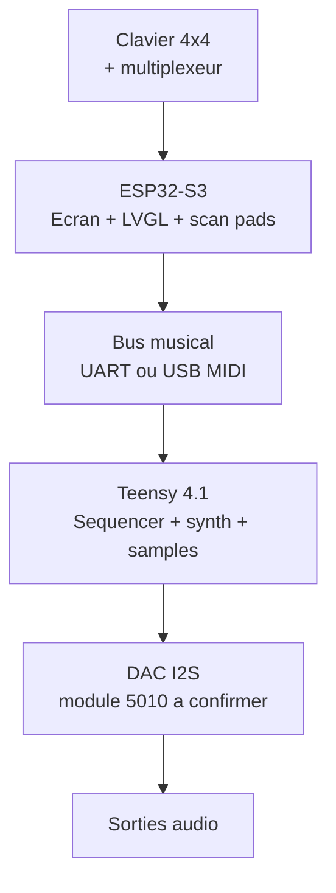
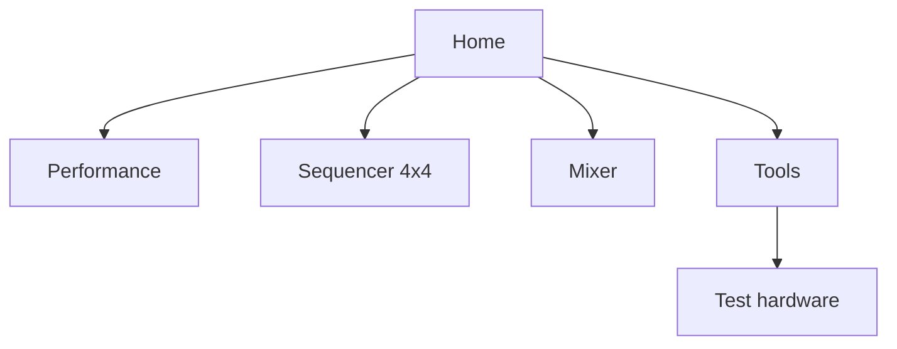

# AZ-2 - Lignes ecran, facade et groovebox

Objectif: figer une premiere direction claire pour AZ-2: une groovebox hardware basee sur Teensy pour l'audio, un ecran ESP32-S3 pour l'interface, et un clavier 4x4 multiplexe lu par l'ESP32.

## Vision produit

AZ-2 doit se comporter comme un instrument autonome:

- Teensy = moteur musical temps reel.
- DAC audio = sortie propre, separee de l'interface.
- ESP32-S3 + ecran = cockpit visuel, menus, sequenceur, mixer, outils.
- Clavier 4x4 = pads, steps, scenes, mutes, navigation performative.
- Multiplexeur = lecture propre du 4x4 sans gaspiller les GPIO.

Decision de base: l'ecran et le clavier 4x4 sont geres par l'ESP32-S3. Le Teensy ne gere pas l'UI, il joue et reste stable.

## Ecran retenu

Documents fournis: `ESP32-4848S040 Specifications-EN.pdf` et `Getting started 4.0 Inch.pdf`.

| Point | Valeur documentee | Note projet |
| --- | --- | --- |
| Module | ESP32-4848S040C_I | Module ecran ESP32-S3 integre |
| MCU | ESP32-S3-WROOM-1 | Wi-Fi, Bluetooth, double coeur |
| Frequence | 240 MHz | Suffisant pour LVGL + scan facade |
| PSRAM | 8 MB | Important pour UI et buffers graphiques |
| Flash | 16 MB | Correct pour firmware UI + assets raisonnables |
| Taille ecran | 4.0 pouces | Format carre, bon pour groovebox compacte |
| Resolution | 480 x 480 px | UI carree, grille 4x4 naturelle |
| Driver LCD | ST7701 | A configurer dans Arduino_GFX/LVGL |
| Couleurs | RGB 65K, 16 bit | Palette sobre, lisible sur scene |
| Tactile | Capacitif | Peut servir aux menus, pas aux actions critiques |
| Stockage | TF card | Presets, assets UI, sauvegardes possibles |
| Alimentation | 5 V, environ 260 mA | Prevoir marge pour retroeclairage |
| Zone active | 71.8 x 70.2 mm | Verifier avec la facade physique |
| Taille module | 86.5 x 86.5 x 37.8 mm | Profondeur importante pour le boitier |

Regle electrique: alimenter le module comme prevu en 5 V, mais ne jamais envoyer de 5 V sur les GPIO. Les signaux logiques doivent rester en 3.3 V.

## DAC audio

Le DAC note comme "5010" doit etre identifie avant schema final. Pistes probables: PCM5102, PCM5100A ou module I2S voisin.

| Point | Direction |
| --- | --- |
| Connexion | I2S depuis Teensy vers DAC |
| Role | Conversion audio principale, pas audio UI |
| Sortie | Line out / casque via etage adapte |
| A confirmer | Reference exacte, brochage, niveau de sortie, alim 3.3 V ou 5 V |

## Architecture fonctionnelle

Le Pico RP2040 devient optionnel. Il peut servir plus tard si on ajoute beaucoup de LEDs, encodeurs, faders ou une matrice plus grande, mais il n'est pas dans la ligne principale actuelle.

## Ligne physique de facade

L'ecran carre donne une vraie logique: la grille 4x4 et l'interface peuvent se repondre visuellement.

| Zone | Placement | Role |
| --- | --- | --- |
| Ecran 4 pouces 480x480 | Centre haut | Pattern, mixer, patch, navigation |
| Encodeurs 1-4 | Sous l'ecran | Parametres contextuels visibles sur la derniere ligne UI |
| Clavier 4x4 | Bas de facade | Steps, pads, scenes, mutes, selection pattern |
| Transport | Bas droit ou tranche basse | Play, Stop, Rec, Tap tempo |
| Boutons systeme | Cote gauche/droit de l'ecran | Home, Back, Shift, Menu |
| TF accessible | Tranche du boitier | Presets, samples courts, assets, backup |
| USB-C | Tranche du boitier | Alimentation, flash, MIDI/serial selon mode |

## Mapping clavier 4x4

Premier mapping simple, adapte a une groovebox.

| Mode | Ligne 1 | Ligne 2 | Ligne 3 | Ligne 4 |
| --- | --- | --- | --- | --- |
| Step Sequencer | Steps 1-4 | Steps 5-8 | Steps 9-12 | Steps 13-16 |
| Drum Pad | Kick / Snare / Hat / Clap | Perc 1-4 | FX 1-4 | Scene 1-4 |
| Mixer | Mute 1-4 | Solo 1-4 | Select track 1-4 | Scene 1-4 |
| Navigation | Pages rapides | Banques | Patterns | Confirm/Cancel/Shift/Menu |

Le tactile peut selectionner des menus, mais les actions musicales rapides doivent rester sur boutons physiques.

## Lignes UI sur l'ecran

Pour 480x480, on pense en blocs carres et lisibles.

### Ecran type: Performance

| Ligne | Hauteur approx. | Contenu |
| --- | ---: | --- |
| Status | 32 px | AZ-2, BPM, MIDI, CPU/audio, alimentation |
| Mode | 48 px | DX, Drum, Sample, Mixer, Seq, Tools |
| Corps | 280 px | Grille 4x4, piste active, pattern, macros |
| Encodeurs | 64 px | E1-E4 + nom + valeur courte |
| Soft keys | 56 px | SAVE, LOAD, FX, ROUTE ou actions page |

### Navigation cible

## Contrat ESP32 vers Teensy

L'ESP32 transforme les gestes UI en messages musicaux. Le Teensy repond avec son et etat machine.

| Source | Destination | Message | Exemple |
| --- | --- | --- | --- |
| ESP32 | Teensy | Pad appuye | `PAD:07:DOWN:vel=110` |
| ESP32 | Teensy | Step toggle | `STEP:track=2,step=11,on=1` |
| ESP32 | Teensy | Macro encodeur | `MACRO:1:+3` |
| ESP32 | Teensy | Transport | `PLAY`, `STOP`, `REC:TOGGLE` |
| Teensy | ESP32 | Etat audio | `BPM:128`, `CPU:42`, `CLIP:0` |
| Teensy | ESP32 | Etat pattern | `PATTERN:A03`, `TRACK:2`, `STEP:11:on` |

## Regles de design

- Le Teensy garde la priorite audio. Aucun menu ESP32 ne doit bloquer le son.
- Le clavier 4x4 est l'organe de jeu principal, pas un simple menu.
- Les encodeurs doivent toujours avoir un label visible a l'ecran.
- Une page = une fonction forte: sequenceur, mixer, performance, tools.
- Le tactile est utile pour regler, pas pour jouer vite.
- Retro-Go ou jeux restent optionnels et isoles du moteur musical.
- Le driver ST7701 doit etre valide sur ce module avant de construire toute l'UI definitive.

## Prochaine passe technique

1. Identifier exactement le DAC "5010" et noter son brochage.
2. Choisir le bus ESP32 -> Teensy: UART serie simple au debut, USB MIDI plus tard si besoin.
3. Definir le multiplexeur du 4x4: reference, pins lignes/colonnes, anti-rebond.
4. Creer `lib/AZ2_Protocol.h` pour les messages ESP32/Teensy.
5. Faire un prototype ESP32: LVGL 480x480 + scan 4x4 + page test hardware.
6. Faire un prototype Teensy: reception messages + bip/test synth + sortie DAC I2S.
