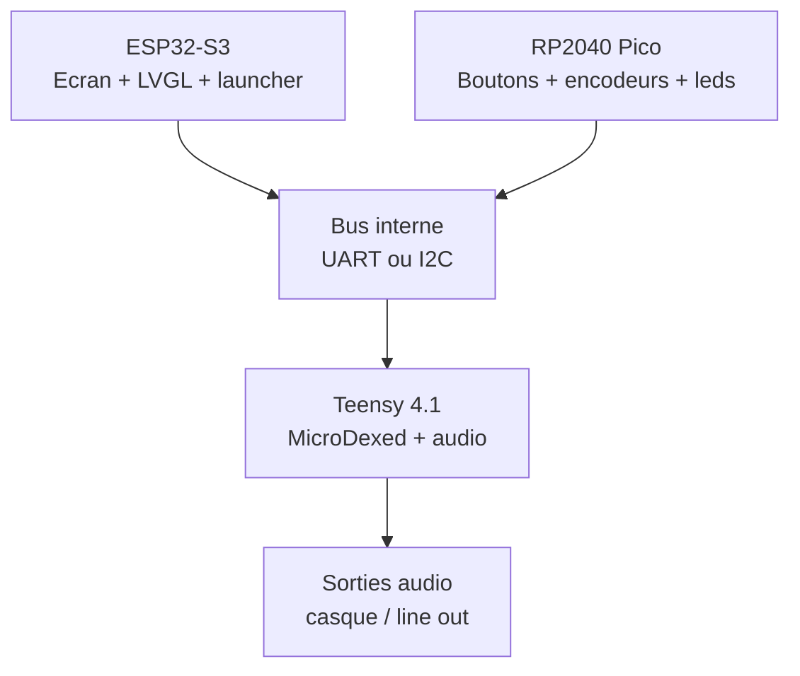
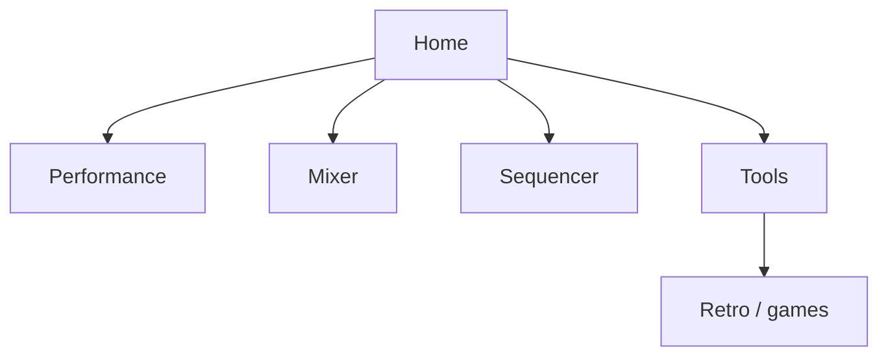

# AZ-2 - Lignes ecran et facade

Objectif: figer une premiere direction claire pour la facade AZ-2 avec un ecran 4 pouces type AliExpress, pilote par ESP32-S3, sans bloquer les choix tant que la fiche technique exacte du module n'est pas confirmee.

## Hypothese ecran

Le lien AliExpress fourni doit etre verifie avant cablage definitif. A confirmer sur la fiche produit ou au multimetre avant alimentation.

| Point | Choix cible | A verifier |
| --- | --- | --- |
| Taille | 4 pouces | Dimensions PCB + zone visible |
| Resolution cible | 480 x 320 ou 800 x 480 | Depend du controleur |
| Bus ecran | SPI si simple, RGB parallele si module haute resolution | Brochage exact du module |
| Tactile | Capacitif si possible | I2C tactile et adresse |
| Alimentation | 5 V entree module, logique 3.3 V | Ne jamais envoyer 5 V sur GPIO ESP32 |
| Librairie | Arduino_GFX + LVGL | Driver reel: ST7796, ILI9488, ST7701, etc. |

Decision de base: l'ecran est l'interface principale, pas le moteur audio. L'ESP32-S3 dessine, le Teensy joue, le Pico lit la facade.

## Architecture fonctionnelle

## Ligne physique de facade

La facade doit rester lisible comme un instrument, pas comme une tablette collee sur une boite. L'ecran est au centre haut, les commandes de jeu/performance restent sous les doigts.

| Zone | Placement | Role |
| --- | --- | --- |
| Ecran 4 pouces | Centre haut | Patch, sequence, mixer, menus, jeux/utilitaires |
| Encodeurs 1-4 | Sous ou autour de l'ecran | Parametres directs selon page affichee |
| Boutons navigation | Gauche/droite de l'ecran | Home, Back, Shift, Menu |
| Pads / touches | Bas de facade | Notes, scenes, patterns, mutes |
| Transport | Bas droit | Play, Stop, Rec, Tap tempo |
| LEDs et petits OLED optionnels | Pres des controles | Retour d'etat sans surcharger l'ecran principal |

## Lignes UI sur l'ecran

Pour un 4 pouces, on garde une interface dense mais respirable. L'ecran doit toujours montrer ou on est, ce qui joue, et ce que les encodeurs controlent.

### Ecran type: Performance

| Ligne | Hauteur approx. | Contenu |
| --- | ---: | --- |
| Status | 24 px | AZ-2, BPM, CPU/audio, batterie/alimentation, MIDI |
| Page | 40 px | Nom du mode: DX, Drums, Tape, Mixer, Seq, Game |
| Corps | 180-300 px | Parametres, grille, forme d'onde, pattern, liste de presets |
| Encodeurs | 40-56 px | Labels E1-E4 + valeur courte |
| Soft keys | 32-48 px | Actions contextuelles: SAVE, LOAD, FX, ROUTE |

### Navigation cible

## Pages a dessiner en premier

1. Home: selection rapide des machines et utilitaires.
2. Performance DX: preset, volume, polyphonie, macro 1-4.
3. Mixer: niveaux, pan, mute, solo, routage FX.
4. Sequencer: pattern, step grid, tempo, swing.
5. Tools: systeme, calibrage facade, test MIDI, test audio.
6. Retro/Game: lanceur isole, sans bloquer l'audio principal.

## Contrat entre cartes

Le code doit eviter que chaque microcontroleur devienne un royaume isole. On definit des messages simples et stables.

| Source | Destination | Message | Exemple |
| --- | --- | --- | --- |
| Pico | ESP32-S3 | Etat facade | `BTN_HOME_DOWN`, `ENC_1_DELTA:+2` |
| ESP32-S3 | Teensy | Changement audio | `SET_PATCH:bank=2,slot=14` |
| Teensy | ESP32-S3 | Etat audio | `VOICE:8`, `CPU:42`, `CLIP:0` |
| ESP32-S3 | Pico | Retour leds | `LED_PAD_04:AMBER` |

## Regles de design

- L'audio reste prioritaire: l'ESP32 ne doit jamais bloquer le Teensy.
- Les encodeurs doivent toujours avoir un label visible a l'ecran.
- Une page = une fonction forte. Pas de menu fourre-tout qui avale le projet.
- Le launcher Retro-Go reste optionnel et sandboxe: amusant, mais pas maitre de l'instrument.
- Avant de coder le driver ecran, identifier le controleur reel du module AliExpress.

## Prochaine passe technique

1. Recuperer la fiche exacte du module ecran: resolution, driver LCD, tactile, pinout.
2. Choisir le bus ESP32-S3 vers ecran: SPI ou RGB selon module.
3. Creer un prototype LVGL avec trois pages: Home, Performance, Mixer.
4. Definir `lib/AZ2_Protocol.h` pour les messages entre ESP32, Pico et Teensy.
5. Brancher un sketch de test: affichage + encodeur + bouton Home + message vers Teensy.
