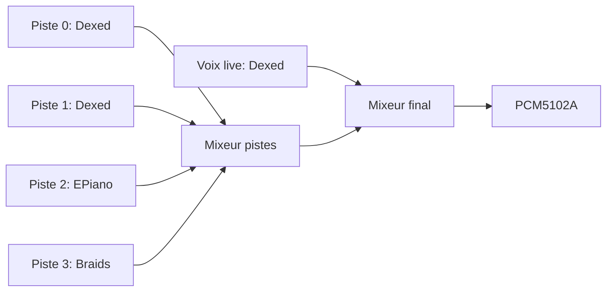

# AZ-2 - Feuille de route moteur audio / mixeur / architecture (2026-09-13)

Contexte: pas de carte SD ni de sample reel dans les machines pour
l'instant -- priorite mise sur les VOIX synthetiques (plusieurs moteurs
connus et legers) plutot que sur le sampleur, qui attendra du vrai
stockage. Rappel utile a garder en tete: **les 3 firmwares (ESP32, Teensy,
Pico) forment UNE seule application** repartie sur 3 cartes -- une
decision cote protocole ou architecture engage generalement les 3, meme
quand une carte n'est pas branchee au moment ou on code.

## Moteurs retenus (deja vendored, verifies dans le repo)

Tous dans `src_teensy/microdexed-touch/third-party/` :

| Moteur | Lib | Style | API de declenchement |
| --- | --- | --- | --- |
| Dexed (FM, DX7-like) | `Synth_Dexed` | Note tenue, tres flexible (algorithmes FM) | `keydown(note, vel)` / `keyup(note)` |
| MDA ePiano | `Synth_MDA_EPiano` | Note tenue, timbre electro-piano celebre (heritage VST mda-epiano) | `noteOn(note, vel)` / `noteOff(note)` |
| Braids (Mutable Instruments) | `Synth_Braids` | Oscillateur "macro" continu, pas de note tenue -- on le "frappe" (`Strike()` interne) a chaque nouvelle hauteur, tres celebre en modulaire/eurorack, leger CPU | `set_braids_pitch(pitch)` (frappe a chaque appel) + `set_braids_shape()`/`timbre()`/`color()` pour la forme d'onde |

Ces trois couvrent des styles tres differents (FM riche, piano electrique,
oscillateur synthese complexe/percussif) pour un minimum de code -- bon
rapport diversite sonore / effort.

## Architecture cible

Decision v0 (simple, pas de switch dynamique de moteur pour l'instant) :
**un moteur fixe par piste**, pas un choix dynamique par l'utilisateur --
ca viendra dans une v1 une fois l'architecture de base solide et testee.

| Piste | Moteur | Role |
| --- | --- | --- |
| 0 | Dexed | FM riche, basses/leads |
| 1 | Dexed | FM riche, deuxieme voix |
| 2 | EPiano | Timbre electro-piano |
| 3 | Braids | Percussif/texture, oscillateur complexe |
| Live (pads/ecran) | Dexed | Jeu au clavier, independant des pistes |

Braids n'a pas de "note off" naturel (oscillateur continu) : on coupe son
canal du mixeur pour simuler un relachement -- character plus percussif/
abrupt, coherent avec son usage typique.

## Ce qui reste a batir (dans l'ordre)

1. **[FAIT]** Multi-moteur fixe par piste (tableau ci-dessus), mixeur a
   2 etages (pistes -> final), toujours pilotable par `PAD:`/`STEP:`/`PLAY`/
   `STOP` existants.
2. **[FAIT]** Grille de sequenceur a l'ecran ESP32 (tactile, 4 pistes x 16
   pas), curseur de lecture synchronise sur `CLOCK:`.
2bis. **[FAIT, 2026-09-14]** "Vrai" sequenceur temps reel, suite a la
   demande explicite ("on est pas assez precis ... il faut les divisions
   le tempo") :
   - Horloge du sequenceur sur `IntervalTimer` materiel (comme
     `PeriodicTimer` dans MicroDexed-touch) au lieu d'un `millis()` scrute
     dans `loop()` -- teste reellement a 180 BPM : 83,33ms attendus, 83,1-
     83,8ms mesures (jitter residuel du cote mesure serie/Python, pas du
     timer). Plus de "temps mort" du a ce que fait `loop()` par ailleurs.
   - Scan clavier du Pico separe en 2 passes (boutons d'abord, LED
     ensuite) -- un appui n'est plus jamais retarde par le rafraichissement
     LED d'une colonne precedente (voir `src_pico/main.cpp`).
   - Division du pas reglable (`DIV:`, table `az2::kDivisionOptions` dans
     AZ2_Protocol.h : 1/4, 1/8, 1/8T, 1/16 par defaut, 1/16T, 1/32) et
     tempo (`BPM:`) exposes sur la page SEQUENCEUR de l'ecran (boutons
     -/+ et bascule de division), plus reglables en aveugle via serie
     seulement.
2ter. **[FAIT, 2026-09-14]** Choix de moteur PAR piste + patchs reels,
   suite a la demande explicite ("les moteurs audio ne sont pas
   selectionnables ni reglables ... sans patch ca va pas, faut faire un
   truc propre") -- avance depuis l'etape 5 initialement prevue plus tard :
   - Chaque piste a ses 3 instances de moteur (Dexed/EPiano/Braids)
     toujours creees, une seule branchee au mixeur a la fois via
     `AudioConnection::connect()`/`disconnect()` (API officielle de patch
     runtime de la lib Audio) -- un moteur non selectionne ne consomme
     AUCUN CPU (la lib ne fait tourner `update()` que sur les objets
     "actifs", voir commentaire dans `src_teensy/az2_audio/main.cpp`).
   - Patchs reels par moteur (pas juste un `loadInitVoice()` vide) :
     8 voix DX7 nommees extraites de la banque vendored Synth_Dexed
     (FM-Rhodes, Steinway, Korg CX3, Leadharp, FatSynth A, Jupiter 8,
     Mini-Moog, Moog Strings), 5 programmes mda ePiano (Default, Bright,
     Mellow, Autopan, Tremolo), 8 formes Braids (CSAW, Saw/Square, Triple
     Saw, Toy, Vosim, FM, Plucked, Saw Swarm).
   - Protocole `ENGINE:piste:moteur` / `PATCH:piste:patch`, table de noms
     partagee ESP32/Teensy/Pico dans AZ2_Protocol.h (`kEngineNames`,
     `k*PatchNames`, `enginePatchCount()`/`enginePatchName()`) -- l'index
     doit rester aligne avec les tableaux de donnees reelles cote Teensy.
   - Nouvelle page ecran "MOTEURS" (une ligne par piste, toucher la
     moitie gauche = cycle moteur, moitie droite = cycle patch).
   - `announceHello()` renvoie tout l'etat courant (bpm, division, moteur+
     patch par piste) a chaque connexion/reconnexion ESP32/Pico, pour que
     l'ecran ne reaffiche jamais des valeurs par defaut fausses.
3. Intro plus vivante (glitch, pixel-art anime) + esprit "logiciel vivant"
   sur les autres pages.
4. Mixeur "vrai" : niveau + pan par piste, exposes au protocole
   (`MIXER:track=N:vol=X` par exemple) et a une page ecran dediee.
5. Edition de note par pas (chaque pas du sequenceur a sa propre note, pas
   une seule note fixe par piste comme actuellement) -- necessaire pour
   de vraies melodies/basslines, pas juste des accords tenus.
6. Sampleur reel, une fois une carte SD presente sur le Teensy (voir
   AZ2_PORTAGE_MICRODEXED_TOUCH.md) -- PSRAM deja confirmee (16 Mo,
   lecture/ecriture OK, teste le 2026-09-13), donc le stockage temporaire
   de samples est pret techniquement des que des fichiers audio existent.
7. Mode JEUX -- **decision revue le 2026-09-14** (voir
   [AZ2_EMULATION_JEUX.md](AZ2_EMULATION_JEUX.md)) : Retro-Go (vendored
   dans `src_esp32/retro-go-master`) etudie et ECARTE pour la v0, car
   ESP-IDF natif + ecrans SPI seulement -- incompatible avec notre
   ecran RGB parallele sans double demarrage OTA + pilote ecran a
   ecrire. Retenu a la place : porter Anemoia-ESP32 (NES, Arduino-natif,
   ~400 lignes de coeur, acces framebuffer brut via
   `connectFramebuffer()`) comme une PAGE de plus dans `az2_screen`, pas
   un double demarrage. Necessite une carte SD ESP32 pour charger de
   vraies ROMs (voir etape suivante) ou une petite ROM homebrew embarquee
   pour tester sans SD.
8. SD sur l'ESP32 (ecran) : ROMs de jeux (format a definir), utile pour
   le mode JEUX (etape 7) une fois la carte presente.
9. Pico transforme en joystick/manette pour le mode jeux (voir
   [AZ2_TODO_PICO.md](AZ2_TODO_PICO.md) -- pas cable actuellement, notes
   accumulees en attendant).

## Impact protocole (a suivre au fur et a mesure)

`DIV:`, `ENGINE:track:moteur` et `PATCH:track:patch` ajoutes le
2026-09-14 (voir etapes 2bis/2ter ci-dessus) -- `BPM:` desormais relaye
(avant : accepte mais jamais confirme a l'UI). Prevoir plus tard :
`MIXER:`, et des messages lies au mode jeux (a definir quand on y
arrivera).
