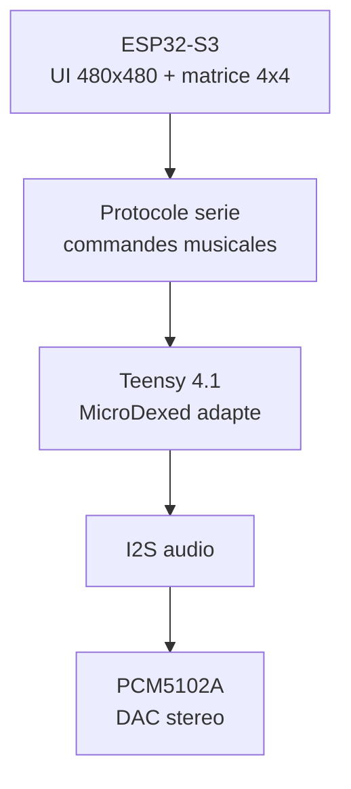

# AZ-2 - Strategie de portage MicroDexed-touch

Source de reference: `https://codeberg.org/positionhigh/MicroDexed-touch`.

Le depot AZ-2 contient deja une copie de MicroDexed-touch dans `src_teensy/microdexed-touch`. Cette base sert de matiere premiere pour le moteur audio, mais pas pour l'interface finale.

## Decision d'architecture

AZ-2 reprend MicroDexed-touch comme moteur musical Teensy, mais remplace sa logique ecran/tactile par une interface ESP32-S3 separee.

| Bloc | MicroDexed-touch original | AZ-2 |
| --- | --- | --- |
| Audio temps reel | Teensy 4.1 | Teensy 4.1 |
| DAC audio | PCM5102A Audio Board en I2S | PCM5102A ou compatible I2S |
| Ecran original | ILI9341 320x240 SPI tactile | ESP32-4848S040C_I 480x480 ST7701 |
| UI | Dans le firmware Teensy | Dans le firmware ESP32-S3 |
| Pads/controle | Encodeurs/touch/UI MicroDexed | Matrice SparkFun 4x4 bouton + LED via ESP32 |
| Communication UI/audio | Interne Teensy | Protocole serie ESP32 -> Teensy |

Conclusion: on ne porte pas l'ecran MicroDexed-touch tel quel. On extrait le moteur musical et on cree une couche de commandes propre pour AZ-2.

## DAC audio identifie

MicroDexed-touch indique dans son `readme.md`:

`This build requires a Teensy 4.1, PCM5102A Audio Board, 320x240 ILI9341 SPI Display with Capacitive Touchscreen and a PSRAM Chip for custom samples.`

Dans `MicroDexed-touch/config.h`, la cible audio active est:

```cpp
#define I2S_AUDIO_ONLY // for PCM5102 or other I2S DACs
```

Dans `MicroDexed-touch.ino`, cette option cree une sortie audio I2S simple:

```cpp
#elif defined(I2S_AUDIO_ONLY)
AudioOutputI2S i2s1;
```

Donc pour AZ-2, le DAC audio principal est un module `PCM5102A` ou un DAC I2S compatible.

## Attention: MCP4728 != DAC audio principal

MicroDexed-touch contient aussi:

```cpp
#include "MCP4728.h"  // 4-Channel DAC 12Bit mcp4728
MCP4728 dac;
```

Ce composant sert au CV/controle analogique sur 4 canaux. Il ne remplace pas le DAC audio PCM5102A.

| Composant | Role | A garder pour AZ-2 |
| --- | --- | --- |
| PCM5102A | DAC audio stereo I2S | Oui, base audio principale |
| MCP4728 | DAC 4 canaux 12-bit pour CV | Optionnel plus tard |
| SGTL5000 | Teensy Audio Board historique | Non prioritaire |
| PT8211 | DAC audio alternatif | Non prioritaire |
| WM8731 | Carte audio TGA | Non prioritaire |

## Ce qu'on garde de MicroDexed-touch

A reprendre progressivement dans `src_teensy`:

- moteur FM MicroDexed / Dexed;
- synthese additionnelle utile: VA, Braids, samples si stable;
- audio graph Teensy;
- mixer, effets, compresseur si CPU OK;
- sequencer 16 steps / patterns / pistes;
- chargement presets et banques depuis SD;
- configuration audio `I2S_AUDIO_ONLY` pour PCM5102A;
- mute PCM5102A via `PCM5102_MUTE_PIN` si le module le permet.

## Ce qu'on retire ou remplace

A ne pas garder tel quel dans le firmware final Teensy:

- UI ILI9341 320x240;
- logique tactile MicroDexed-touch;
- menus LCD internes;
- scan encodeurs/boutons qui appartiennent a la facade AZ-2;
- dependances ecran qui bloquent la compilation audio;
- affichage direct depuis le Teensy.

Ces elements sont remplaces par l'ESP32-S3 et son ecran 480x480.

## Nouveau partage des roles



## Protocole minimal de portage

Le Teensy doit recevoir des commandes simples, stables et testables.

| Commande | Sens | Exemple |
| --- | --- | --- |
| Pad press | ESP32 -> Teensy | `PAD:07:DOWN:vel=110` |
| Pad release | ESP32 -> Teensy | `PAD:07:UP` |
| Step toggle | ESP32 -> Teensy | `STEP:track=2,step=11,on=1` |
| Transport | ESP32 -> Teensy | `PLAY`, `STOP`, `REC:TOGGLE` |
| Patch | ESP32 -> Teensy | `PATCH:bank=2,slot=14` |
| Macro | ESP32 -> Teensy | `MACRO:1:+3` |
| Etat audio | Teensy -> ESP32 | `BPM:128`, `CPU:42`, `CLIP:0` |
| Etat LED | Teensy -> ESP32 | `LED:11:ON`, `LED:02:BLINK` |

## Plan de portage

1. Compiler MicroDexed-touch en mode `I2S_AUDIO_ONLY` avec `PCM5102A`.
2. Isoler le moteur audio dans une cible Teensy AZ-2 sans UI ILI9341.
3. Ajouter une entree serie simple pour recevoir `PLAY`, `STOP`, `PAD`.
4. Faire jouer un son test depuis la matrice SparkFun via ESP32.
5. Ajouter le sequenceur 16 steps, puis les patterns.
6. Refaire l'UI en LVGL 480x480 cote ESP32.
7. Rebrancher progressivement banques, presets, samples, mixer et effets.

## Regle de securite sonore

MicroDexed-touch peut produire une forte dynamique audio. Pour les tests AZ-2:

- volume ampli/casque a zero au premier boot;
- un limiteur ou volume master bas par defaut;
- mute PCM5102A actif au demarrage si le pin `XSMT` est cable;
- tests audio d'abord sur petit haut-parleur ou entree ligne protegee.
