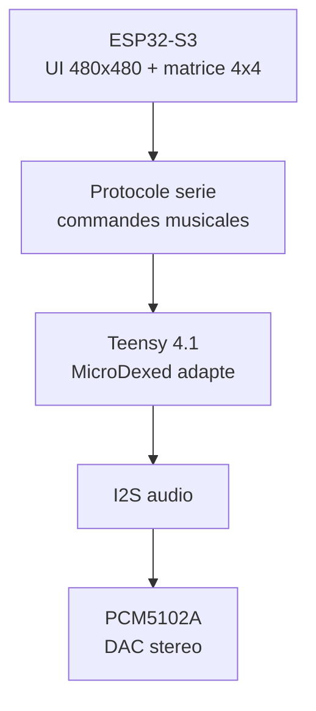

# AZ-2 - Strategie de portage MicroDexed-touch

Source de reference: `https://codeberg.org/positionhigh/MicroDexed-touch`.

Le depot AZ-2 contient deja une copie de MicroDexed-touch dans `src_teensy/microdexed-touch`. Cette base sert de matiere premiere pour le moteur audio, mais pas pour l'interface finale.

## Decision d'architecture

AZ-2 reprend MicroDexed-touch comme moteur musical Teensy, mais remplace sa logique ecran/tactile par une interface ESP32-S3 separee.

| Bloc | MicroDexed-touch original | AZ-2 |
| --- | --- | --- |
| Audio temps reel | Teensy 4.1 | Teensy 4.1 |
| DAC audio | PCM5102A Audio Board en I2S | PCM5102A I2S 3.3 V |
| Ecran original | ILI9341 320x240 SPI tactile | VIEWE UEDX48480040E-WB 480x480 GC9503V (identifie le 2026-09-13 -- pas l'ESP32-4848S040C_I/ST7701 suppose au tout depart) |
| UI | Dans le firmware Teensy | Dans le firmware ESP32-S3 |
| Pads/controle | Encodeurs/touch/UI MicroDexed | Matrice SparkFun 4x4 bouton + LED via ESP32 |
| Communication UI/audio | Interne Teensy | Protocole serie ESP32 -> Teensy |

Conclusion: on ne porte pas l'ecran MicroDexed-touch tel quel. On extrait le moteur musical et on cree une couche de commandes propre pour AZ-2.

## DAC audio identifie

MicroDexed-touch indique dans son `readme.md`:

`This build requires a Teensy 4.1, PCM5102A Audio Board, 320x240 ILI9341 SPI Display with Capacitive Touchscreen and a PSRAM Chip for custom samples.`

Dans `MicroDexed-touch/config.h`, la cible audio active est:

```cpp
#define I2S_AUDIO_ONLY // for PCM5102 or other I2S DACs
```

Dans `MicroDexed-touch.ino`, cette option cree une sortie audio I2S simple:

```cpp
#elif defined(I2S_AUDIO_ONLY)
AudioOutputI2S i2s1;
```

Donc pour AZ-2, le DAC audio principal est le module `PCM5102A` en I2S. Il est alimente en 3.3 V, sort en niveau ligne 2.1 VRMS, et n'a pas besoin de MCLK.

## Attention: MCP4728 != DAC audio principal

MicroDexed-touch contient aussi:

```cpp
#include "MCP4728.h"  // 4-Channel DAC 12Bit mcp4728
MCP4728 dac;
```

Ce composant sert au CV/controle analogique sur 4 canaux. Il ne remplace pas le DAC audio PCM5102A.

| Composant | Role | A garder pour AZ-2 |
| --- | --- | --- |
| PCM5102A | DAC audio stereo I2S | Oui, base audio principale |
| MCP4728 | DAC 4 canaux 12-bit pour CV | Optionnel plus tard |
| SGTL5000 | Teensy Audio Board historique | Non prioritaire |
| PT8211 | DAC audio alternatif | Non prioritaire |
| WM8731 | Carte audio TGA | Non prioritaire |

## Ce qu'on garde de MicroDexed-touch

A reprendre progressivement dans `src_teensy`:

- moteur FM MicroDexed / Dexed;
- synthese additionnelle utile: VA, Braids, samples si stable;
- audio graph Teensy;
- mixer, effets, compresseur si CPU OK;
- sequencer 16 steps / patterns / pistes;
- chargement presets et banques depuis SD;
- configuration audio `I2S_AUDIO_ONLY` pour PCM5102A;
- mute PCM5102A via `PCM5102_MUTE_PIN` si le module le permet.

## Ce qu'on retire ou remplace

A ne pas garder tel quel dans le firmware final Teensy:

- UI ILI9341 320x240;
- logique tactile MicroDexed-touch;
- menus LCD internes;
- scan encodeurs/boutons qui appartiennent a la facade AZ-2;
- dependances ecran qui bloquent la compilation audio;
- affichage direct depuis le Teensy.

Ces elements sont remplaces par l'ESP32-S3 et son ecran 480x480.

## Nouveau partage des roles



## Protocole minimal de portage

Le Teensy doit recevoir des commandes simples, stables et testables.
Format reellement implemente (colonnes ` : `, pas de virgules) :

| Commande | Sens | Exemple |
| --- | --- | --- |
| Pad press | ESP32/Pico -> Teensy | `PAD:07:DOWN:vel=110` |
| Pad release | ESP32/Pico -> Teensy | `PAD:07:UP` |
| Step toggle | ESP32 -> Teensy | `STEP:2:11:1` (piste 2, pas 11, on) |
| Tempo | ESP32 -> Teensy | `BPM:140` |
| Transport | ESP32 -> Teensy | `PLAY`, `STOP` |
| Macro (encodeur) | Pico -> Teensy | `MACRO:1:+3` |
| Etat audio | Teensy -> ESP32/Pico | `STATUS:TEENSY_AUDIO:PLAYING` |
| Horloge sequenceur | Teensy -> ESP32/Pico | `CLOCK:bar=3:step=11` |
| Etat LED | Teensy -> ESP32/Pico | `LED:11:ON`, `LED:11:OFF` |

`PATCH:bank=x,slot=y` et `REC:TOGGLE` pas encore implementes (futur, quand
la gestion SD de patchs sera portee).

## Architecture moteur v1 (2026-09-13, confirmee par test reel)

Reprend `NUM_DEXED` de MicroDexed-touch (4 instances Dexed), adapte a
l'echelle AZ-2 :

| Voix | Role | Polyphonie |
| --- | --- | --- |
| Piste 0-3 (`track0`-`track3`) | Une instance `AudioSynthDexed` par piste du sequenceur | 2 notes/piste |
| `liveVoice` | Jeu au clavier (pads/page AUDIO ecran), separee des pistes | 4 notes |

Sequenceur : 16 pas x 4 pistes (`kStepCount`/`kTrackCount` dans
`src_teensy/az2_audio/main.cpp`), une note fixe par piste pour l'instant
(edition de note par pas = prochaine etape). Toutes les voix passent par
`AudioMixer4 mixTracks` (les 4 pistes) puis `AudioMixer4 mixFinal` (pistes +
voix live) avant `AudioOutputI2S`.

Teste reellement (2026-09-13) : pas programmes sur 2 pistes via `STEP:`,
lecture a 140 BPM, horloge (`CLOCK:`) qui avance et boucle correctement,
`STOP` qui coupe tout proprement.

### Architecture moteur v1.1 (2026-09-14 -- moteur/patch dynamiques + horloge reelle)

Suite a la demande explicite ("pas assez precis ... faut les divisions
le tempo" + "les moteurs audio ne sont pas selectionnables ni reglables
... faut faire un truc propre"), 2 changements structurels par rapport
au v1 ci-dessus (detail complet dans
[AZ2_FEUILLE_DE_ROUTE_MOTEUR.md](AZ2_FEUILLE_DE_ROUTE_MOTEUR.md), etapes
2bis/2ter) :

- Chaque piste n'a plus un seul moteur fixe : elle a ses 3 instances
  (Dexed/EPiano/Braids) et une seule est branchee au mixeur a la fois
  (`ENGINE:`/`PATCH:`, rebranchage a la volee via
  `AudioConnection::connect()`/`disconnect()`).
- L'horloge du sequenceur tourne sur `IntervalTimer` (interruption
  materielle), pas sur un `millis()` scrute dans `loop()` -- precision
  verifiee reellement (180 BPM -> 83,3ms/pas mesures a +/-0,5ms pres).
- Division du pas reglable (`DIV:`), plus fixee a 1/16.

## Plan de portage

1. Compiler MicroDexed-touch en mode `I2S_AUDIO_ONLY` avec `PCM5102A`. **Fait** (config de reference identifiee, pas compile tel quel -- moteur reecrit directement avec Synth_Dexed).
2. Isoler le moteur audio dans une cible Teensy AZ-2 sans UI ILI9341. **Fait.**
3. Ajouter une entree serie simple pour recevoir `PLAY`, `STOP`, `PAD`. **Fait et teste** (son confirme).
4. Faire jouer un son test depuis la matrice SparkFun via ESP32. **Fait** (Pico + page AUDIO ecran, testes separement).
5. Ajouter le sequenceur 16 steps, puis les patterns. **Sequenceur 16 pas x 4 pistes fait et teste.** Patterns (plusieurs sequences memorisees/enchainees) : pas encore fait.
6. Refaire l'UI en LVGL 480x480 cote ESP32. **En cours** : menu de test + pages PADS/ENCODEURS/AUDIO/LIENS SERIE faites (sans LVGL, Arduino_GFX direct) ; grille de sequenceur tactile = prochaine etape.
7. Rebrancher progressivement banques, presets, samples, mixer et effets. Pas commence.

## Regle de securite sonore

MicroDexed-touch peut produire une forte dynamique audio. Pour les tests AZ-2:

- volume ampli/casque a zero au premier boot;
- un limiteur ou volume master bas par defaut;
- mute PCM5102A actif au demarrage si le pin `XSMT` est cable;
- tests audio d'abord sur petit haut-parleur ou entree ligne protegee.
