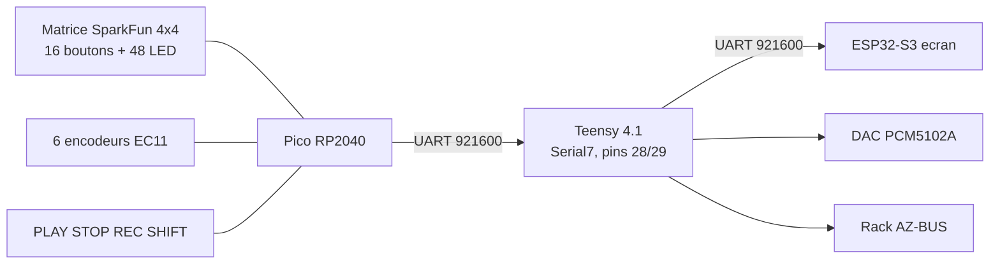

# AZ-3 — Feuille de câblage du panneau de contrôle

**Version :** V2, 19 septembre 2026
**Branche :** `az3` · **Firmware :** `src_pico/`, environnement `ctrl_pico`

> ### 🔒 PLAN FIGÉ le 2026-09-19
>
> Le brochage ci-dessous est arrêté. Rien n'est soudé, le Pico n'est pas
> encore branché, le module LED n'est pas encore livré — **c'est le plan à
> suivre le fer à souder en main**, pas une proposition ouverte.
>
> Toute modification ultérieure doit passer par `src_pico/az3_panel_config.h`
> **et** par ce document, en même temps. Le firmware compile déjà contre ce
> brochage.
>
> **Rien n'est vérifié sur le vrai matériel.** Voir §12.

Référence unique pour câbler la façade de l'AZ-3. Remplace
[AZ2_CABLAGE_PICO.md](AZ2_CABLAGE_PICO.md) (plan abandonné) et
[AZ2_CABLAGE_BASE.md](AZ2_CABLAGE_BASE.md) (historique).

---

## 1. Le principe, en une phrase

> **Un CD74HC4067 est un interrupteur qui relie UN canal à la fois à un seul
> fil.**

Tout le brochage découle de là :

| Bloc | Mux ? | Pourquoi |
|---|:-:|---|
| **Boutons** | ✅ | Un bouton est lent. Lire 16 canaux d'affilée prend ~80 µs, personne ne le voit. |
| **Lignes de matrice** | ✅ | Même chose qu'un bouton, lu une colonne à la fois. |
| **Encodeurs** | ❌ | A et B doivent être lus **au même instant**. Le mux les lit à ~6 µs d'écart et peut renvoyer un état faux pendant une transition. |
| **LED** | ❌ | Une seule LED allumée à la fois sur 48 = **2 % du temps**, et aucune régulation de courant. |

Les LED vont donc sur un **IS31FL3731** en I2C, qui balaie **en matériel**, à
courant constant, avec un PWM 8 bits par LED. Le Pico n'écrit qu'une image :
plus aucune contrainte temps réel, et 2 broches au lieu de 5.

Et le point qui rend tout ça possible : **plusieurs mux partagent les mêmes 4
lignes d'adresse** et ne coûtent qu'**une broche chacun** (leur SIG).

---

## 2. Les trois cerveaux

| Carte | Rôle |
|---|---|
| **ESP32-S3** | écran 480×480, Wi-Fi, carte SD, projets, émulateur GB |
| **Teensy 4.1** | moteurs audio, séquenceur, DAC PCM5102A, rack AZ-BUS |
| **Pico RP2040** | **toute la façade** |

Le Teensy n'a plus **aucune** commande : ses 17 broches libérées (GPIO 2-6,
8, 9, 14-19, 22-25) partent au rack AZ-BUS.

---

## 3. Brochage du Pico — **26 broches sur 26**

Le RP2040 a 26 broches utilisables : GPIO 0-22 et 26-28. GPIO 23 pilote le
mode d'alimentation SMPS, GPIO 24 détecte le VBUS, GPIO 25 est la LED
embarquée — les trois sont exclues.

| Usage | GPIO | Nb | Sens |
|---|---:|:-:|---|
| UART TX → Teensy pin 28 (RX7) | 0 | 1 | sortie |
| UART RX ← Teensy pin 29 (TX7) | 1 | 1 | entrée |
| Colonnes matrice COL_0…3 | 2, 3, 4, 5 | 4 | sortie (LOW au scan) |
| Adresse mux S0…S3 (**partagée**) | 6, 7, 8, 9 | 4 | sortie |
| SIG mux **BOUTONS** | 10 | 1 | entrée `INPUT_PULLUP` |
| SIG mux **LIGNES** | 11 | 1 | entrée `INPUT_PULLUP` |
| **I2C0 SDA** → IS31FL3731 | 12 | 1 | bidirectionnel |
| **I2C0 SCL** → IS31FL3731 | 13 | 1 | sortie |
| Encodeur 1 — A, B | 14, 15 | 2 | entrée `INPUT_PULLUP` |
| Encodeur 2 — A, B | 16, 17 | 2 | entrée `INPUT_PULLUP` |
| Encodeur 3 — A, B | 18, 19 | 2 | entrée `INPUT_PULLUP` |
| Encodeur 4 — A, B | 20, 21 | 2 | entrée `INPUT_PULLUP` |
| Encodeur 5 — A, B | 22, 26 | 2 | entrée `INPUT_PULLUP` |
| Encodeur 6 — A, B | 27, 28 | 2 | entrée `INPUT_PULLUP` |
| LED embarquée (heartbeat) | 25 | — | interne |

Les **clics d'encodeur** ne coûtent aucune GPIO : ils passent par le mux
boutons. GPIO 12/13 ne sont pas choisies au hasard — ce sont des broches
I2C0 valides du RP2040 (SDA sur 0/4/8/12/16/20, SCL sur 1/5/9/13/17/21).

> **Pourquoi 6 encodeurs et pas plus.** La quadrature coûte 2 vraies GPIO par
> encodeur et il n'en reste aucune. Le 6ᵉ n'existe que parce que les 4 lignes
> de matrice ont été déportées sur un mux : 4 GPIO libérées pour 1 broche de
> SIG. Pour aller à 8, il faudrait 2× 74HC165 (~0,60 €), qui capturent 16
> entrées d'un coup — ou changer de carte pour un RP2350**B** (48 GPIO), et
> surtout pas un « Pico 2 » standard qui a les mêmes 26 GPIO.

---

## 4. Multiplexeurs

Tous les mux reçoivent les **mêmes** S0-S3 (GPIO 6-9) et gardent chacun leur
propre SIG.

### 4.1 Mux BOUTONS — SIG sur GPIO 10

| Canal | Signal |
|---:|---|
| 0-5 | Clics des encodeurs 1 à 6 |
| 8 | **PLAY** |
| 9 | **STOP** |
| 10 | **REC** (bascule START/STOP) |
| 11 | **SHIFT** |
| 6, 7, 12-15 | *libres* |

L'autre patte de chaque bouton va au **GND**. SIG est lu en `INPUT_PULLUP` :
contact fermé = canal tiré au GND. La résistance passante du 4067 (~70 Ω) est
négligeable devant le pull-up interne (~50 kΩ).

### 4.2 Mux LIGNES — SIG sur GPIO 11

| Canal | Signal |
|---:|---|
| 0-3 | Lignes ROW_0 à ROW_3 de la matrice |
| 4-15 | *libres* (16 entrées lentes de plus pour 0 broche) |

> ⚠ **Pose 4 résistances de pull-up de 10 kΩ** (une par ligne, vers 3,3 V).
> Une ligne non sélectionnée par le mux est **complètement flottante** ; à la
> sélection, le pull-up interne du Pico (~50 kΩ) doit recharger la capacité du
> câblage, soit ~5 µs de constante de temps et ~25 µs pour une lecture franche.
> Avec 10 kΩ externes on tombe à ~1 µs et l'incertitude disparaît. Le firmware
> attend `kRowMuxSettleUs` = 25 µs pour marcher même sans, mais c'est 4
> résistances bien investies.

### 4.3 ⚠ La broche EN — la panne qui a tué le projet en 2026-09

**EN de CHAQUE CD74HC4067 va au GND commun.**

Elle est active à l'état **BAS**. Laissée en l'air, le multiplexeur entier
reste désactivé en permanence : aucun canal ne passe jamais, quoi que fassent
S0-S3 et SIG.

C'est exactement le symptôme du 2026-09-14 — zéro LED sur 48 combinaisons
testées, alors que boutons et alimentation étaient corrects — et c'est ce qui
a fait abandonner le Pico. La cause avait été trouvée, **mais la correction
n'a jamais été revérifiée** : `AZ2_CABLAGE_PICO.md` dit « en cours de câblage,
pas encore reverifiee ».

**Continuité EN → GND au multimètre, avant tout le reste.**

---

## 5. LED — module IS31FL3731

Module validé : **« IS31FL3731 2946 »** — la référence `2946` est celle du
breakout Adafruit du même nom, c'est-à-dire le **driver nu**, avec ses broches
sorties sur connecteur.

> ⚠ **Surtout pas une matrice LED déjà peuplée.** La plupart des annonces
> « IS31FL3731 » sont des clones du CharliePlex 15×7 **avec leurs propres LED
> soudées dessus**. Inutiles ici : nos LED sont déjà dans le pad SparkFun.

Ce que le module apporte, et que le mux ne pouvait pas donner :

- **courant constant intégré** — aucune résistance externe
- **PWM 8 bits par LED**, luminosité réglable individuellement
- **balayage en matériel** — zéro charge CPU, aucun scintillement
- **2,7 – 5,5 V** — alimentation directe en 3,3 V, pas d'adaptateur de niveau
- **adresse configurable + connecteur Qwiic** — chaîner un 2ᵉ module = un câble

### 5.1 Le seul point à vérifier sur la datasheet

Le pad demande **12 anodes × 4 cathodes**. L'IS31FL3731 est une matrice
16 × 9 : un côté a 16 sorties (broches `C1-C16`), l'autre 9 (`A1-A9`). Reste à
savoir **lequel est le côté anode** — le schéma d'application type de la
datasheet le donne en une ligne : regarder si l'anode des LED part sur une
broche `C` ou sur une broche `A`.

| Si le côté anode est… | Il faut | Constante à mettre |
|---|---|---|
| **C** (16 sorties) | **un seul module** : 12 anodes sur C1-C12, 4 colonnes sur A1-A4 | `kAnodeSide = AnodeSide::C16` *(défaut)* |
| **A** (9 sorties) | **deux modules** : 6 anodes chacun, même bus I2C | `kAnodeSide = AnodeSide::A9` |

Les deux cas sont gérés par le firmware — **une seule constante à changer**
dans `src_pico/az3_led_driver.h`, rien d'autre. Les deux variantes compilent.

**En commander deux est la décision qui ne peut pas être fausse** : dans le
cas favorable, le second sert de rechange.

### 5.2 Câblage

| Module | Pico |
|---|---|
| SDA | GPIO 12 |
| SCL | GPIO 13 |
| VCC | 3,3 V |
| GND | GND |

| Module | Pad SparkFun |
|---|---|
| Côté anode (12 lignes) | les 12 anodes : rouge 0-3, vert 0-3, bleu 0-3 |
| Côté cathode (4 lignes) | les 4 colonnes (cathodes communes) |

Adresses I2C, fixées par la broche **AD** : GND → `0x74`, VCC → `0x75`,
SDA → `0x76`, SCL → `0x77`. Avec deux modules : le premier en `0x74`, le
second en `0x75`.

> **Les colonnes LED sont séparées des colonnes boutons.** Le firmware
> suppose que la matrice de boutons et la matrice de LED sont deux circuits
> distincts sur la carte SparkFun (4+4 fils pour les boutons, 4+12 pour les
> LED) — c'est ce que décrit le guide, mais il signale aussi que la
> sérigraphie prête à confusion. **À confirmer au multimètre.**

---

## 6. Matrice SparkFun 4×4 RGB

**Vraie matrice** ligne/colonne, pas 16 boutons indépendants : appuyer sur un
pad relie sa ligne à sa colonne. Les LED sont trois matrices 4×4 superposées,
une par couleur, partageant les mêmes 4 colonnes (cathodes communes).

Référence : <https://learn.sparkfun.com/tutorials/button-pad-hookup-guide/all>

Numérotation AZ-2 (`pad = ligne × 4 + colonne`, voir `az2::padId`) :

| | COL_0 | COL_1 | COL_2 | COL_3 |
|---|:-:|:-:|:-:|:-:|
| **ROW_0** | 0 | 1 | 2 | 3 |
| **ROW_1** | 4 | 5 | 6 | 7 |
| **ROW_2** | 8 | 9 | 10 | 11 |
| **ROW_3** | 12 | 13 | 14 | 15 |

Deux pièges documentés par SparkFun :

- les connexions du bas sont des **colonnes**, pas de vrais GND — suivre le
  guide plutôt que de deviner au multimètre en mode continuité ;
- **errata Vert/Bleu inversé** sur certains lots. Si les couleurs sortent
  échangées, inverse les deux fils.

Côté firmware, une seule colonne est pilotée à LOW à la fois, les autres
restent en haute impédance (`INPUT`) — jamais à HIGH : si deux touches d'une
même ligne sont enfoncées, deux colonnes se retrouvent reliées, et une sortie
à HIGH face à une sortie à LOW est un court-circuit franc entre deux GPIO.

---

## 7. Rôles des encodeurs

La croix et les boutons A/B/C/D **disparaissent en matériel**. Leurs messages
`NAV:` et `BTN:` continuent pourtant d'exister : le Pico les **synthétise**.
C'est ce qui permet à l'UI de l'ESP32 (4680 lignes) de fonctionner **sans une
seule modification**.

| Enc. | Rotation | Clic | Remplace |
|---:|---|---|---|
| 1 | `NAV:UP` / `NAV:DOWN` | `BTN:A` | croix ↑↓ + bouton A (valider) |
| 2 | `NAV:LEFT` / `NAV:RIGHT` | `BTN:B` | croix ←→ + bouton B (retour) |
| 3 | `POT:0` — volume | `BTN:C` | potard 1 + bouton C |
| 4 | `POT:1` — reverb | `BTN:D` | potard 2 + bouton D |
| 5 | `POT:2` — delay | `ENC:4` | potard 3, qui retrouve une molette |
| 6 | `MACRO:0` — transpose | `ENC:5` | — |

Tout se règle dans **une seule table**, `kEncoders` de
`src_pico/az3_panel_config.h`. Ajouter, retirer ou réaffecter un encodeur est
une ligne.

### Mode manette

Un encodeur émet une **impulsion**, il ne peut pas *maintenir* une direction —
sans conséquence pour les menus (l'ESP32 agit sur `:DOWN`), rédhibitoire pour
l'émulateur Game Boy. En mode manette, huit pads prennent le relais :

| | COL_0 | COL_1 | COL_2 | COL_3 |
|---|:-:|:-:|:-:|:-:|
| **ROW_0** | | **↑** | | SELECT |
| **ROW_1** | **←** | | **→** | START |
| **ROW_2** | | **↓** | | **B** |
| **ROW_3** | | | | **A** |

Bascule par `PANEL:MODE:GAME` / `PANEL:MODE:MUSIC`, envoyé par l'écran. Le
mapping colle à ce que l'ESP32 attend déjà (croix → `NAV:`, A/B → `BTN:`,
SELECT/START → `ENC:1`/`ENC:2`) : **aucune modification côté écran**.

---

## 8. Liaison vers le Teensy

| Pico | Teensy 4.1 |
|---|---|
| GPIO 0 (TX) | pin 28 (RX7) |
| GPIO 1 (RX) | pin 29 (TX7) |
| GND | **GND — obligatoire** |

Débit : `az2::kControlBaud` = **921600**. Les deux firmwares lisent la même
constante de `lib/AZ2_Protocol/AZ2_Protocol.h`, les deux bouts restent donc
d'accord automatiquement.

Pourquoi `Serial7` et pas `Serial3` (pins 14/15), l'ancien lien Pico : ces
broches avaient été réaffectées à l'encodeur 1 en AZ-2. `Serial2` (7/8) et
`Serial5` (20/21) touchent l'I2S ou d'anciens boutons.

Ce que le Teensy fait des messages reçus :

| Message | Traitement |
|---|---|
| `PAD:NN:DOWN/UP/HOLD` | joue la voix live |
| `MACRO:<n>:±N` | transpose, puis relaie |
| `POT:<0-2>:<0-127>` | **applique** volume / reverb / delay, puis relaie |
| `NAV:` `BTN:` `ENC:` | relaie tel quel vers l'ESP32 |
| `PLAY` / `STOP` / `REC:START` / `REC:STOP` | transport |
| `HELLO:PICO_KEYPAD` | répond `HELLO:TEENSY_AUDIO` sur `Serial7` |

---

## 9. Liste de composants

| Qté | Composant | État |
|---:|---|---|
| 1 | Raspberry Pi Pico (RP2040) | **à câbler** — jamais branché à ce jour |
| 1 | Matrice SparkFun 4×4 RGB | en stock |
| 2 | CD74HC4067 | en stock (plusieurs dispo) — boutons + lignes |
| **2** | **Module IS31FL3731 « 2946 »** | **à commander**, voir ci-dessous |
| 6 | Encodeur EC11 avec bouton | à vérifier en stock |
| 4 | Bouton poussoir | PLAY / STOP / REC / SHIFT |
| 4 | Résistance 10 kΩ | pull-ups des lignes de matrice (§4.2) |

Aucune résistance pour les LED : le driver régule le courant lui-même.

### 9.1 Module LED retenu — référence figée

> **« Module de pilotage de matrice LED PWM 16x9 2946 IS31FL3731, interface
> I2C, compatible STEMMA QT / Qwiic »**
> — vendeur *Shenzhen Module Studio Co., Ltd*, AliExpress.

Caractéristiques annoncées par la fiche produit, et ce qu'elles impliquent ici :

| Annoncé | Conséquence pour l'AZ-3 |
|---|---|
| IS31FL3731, matrice PWM 16×9, jusqu'à 144 LED, 8 bits par canal | 48 LED nécessaires — large marge |
| **Aucune résistance externe de limitation de courant requise** | c'est **la** chose que le CD74HC4067 ne savait pas faire |
| Régulation globale du courant, annulation de diaphonie, sans scintillement | les trois couleurs auront enfin la même luminosité |
| **2,7 – 5,5 V** | alimentation directe en 3,3 V, **aucun adaptateur de niveau** |
| Adresse esclave configurable, plusieurs modules sur le même bus | deux modules = toujours 2 broches |
| Connecteur JST SH 4 broches (STEMMA QT / Qwiic) | chaîner le 2ᵉ module = un câble, zéro soudure |
| « rétroéclairage de claviers » cité comme usage type | c'est exactement notre cas |

**Pourquoi deux et pas un** : voir §5.1. Tant que la datasheet n'a pas dit de
quel côté sont les anodes, deux est la seule quantité qui ne peut pas être
fausse — et dans le cas favorable le second sert de rechange.

**À vérifier à la réception**, en une minute : que les broches `C1-C16` et
`A1-A9` du driver soient bien **sorties sur connecteur**. Le connecteur Qwiic
ne porte que l'I2C ; il faut aussi pouvoir atteindre le côté LED pour y
brancher les 12 anodes et les 4 colonnes du pad. La mention « 2946 » (la
référence du breakout Adafruit du même nom, qui est le driver nu) le laisse
attendre, mais ça reste une inférence, pas une garantie du vendeur.

---

## 10. Mise en service

**Dans cet ordre.** Les étapes 1 à 8 ne demandent pas le Teensy : tous les
diagnostics se pilotent au moniteur série USB du Pico (**921600 bauds**).

### Au multimètre, avant de mettre sous tension

1. **Continuité EN → GND** sur chaque CD74HC4067. *C'est la vérification qui
   aurait évité l'abandon de 2026-09.*
2. Pas de court-circuit entre 3,3 V et GND.
3. **Boutons et LED bien séparés** sur la carte SparkFun (§5.2).

### Pico seul

4. **Flasher** : `pio run -e ctrl_pico -t upload`. Sans outil : maintenir
   BOOTSEL au branchement et glisser `.pio/build/ctrl_pico/firmware.uf2` sur
   le volume `RPI-RP2`.
5. **Boot** : `AZ2:ROLE:PICO_KEYPAD`, la liste des fonctions, le résultat du
   scan I2C, puis `STATUS:PICO_KEYPAD:READY` une fois par seconde. LED
   embarquée à 2 clignotements/s.
6. **`SELFTEST`** — enchaîne identité, scan I2C, mux, encodeurs et pads en un
   seul compte rendu.

### Bloc par bloc

| Commande | Ce qu'elle vérifie |
|---|---|
| `LEDSCAN` | quelles adresses I2C répondent. **Aucune → alim, SDA/SCL, ou broche AD.** |
| `MUXTEST` | les 16 canaux du mux boutons. **Les 16 figés → EN pas au GND.** |
| `ENCTEST` | état brut A/B et compteur de crans, sans passer par les rôles |
| `PADTEST` | état de la matrice, ligne par ligne |
| `LEDTEST` | allume les 48 LED une par une, ~0,3 s chacune, en annonçant laquelle |
| `LEDTEST:STOP` | revient à l'affichage normal |
| `VERSION` | rappelle l'identité et les fonctions |

7. **Pads** : chaque pad donne `PAD:00`…`PAD:15` en `DOWN`/`UP`, et `HOLD`
   après 600 ms. *(Confirmé sur le vrai matériel le 2026-09-13.)*
8. **Encodeurs** : rotation → `NAV:`, `POT:`, `MACRO:` selon §7 ; clic →
   `BTN:A`…`D` puis `ENC:`.

### Chaîne complète

9. Câbler GPIO 0/1 → Teensy 28/29 **+ GND**, flasher le Teensy, vérifier
   `HELLO:TEENSY_AUDIO` en retour (le Pico le réaffiche préfixé `TEENSY:`).
10. Tourner l'encodeur 3 : le volume doit changer **à l'oreille** *et* à
    l'écran.

---

## 11. Dépannage

| Symptôme | Cause la plus probable |
|---|---|
| Le Pico n'apparaît pas du tout à l'ordinateur | câble micro-USB **charge seule** — le grand classique |
| `LEDSCAN` ne trouve aucune puce | alimentation du module, SDA/SCL inversés, ou broche AD flottante |
| Aucun canal de mux ne répond | **EN pas au GND** (§4.3) |
| Une couleur entière manque | 4 anodes d'un coup → câblage d'un groupe, ou `kAnodeSide` à l'envers (§5.1) |
| Vert et bleu inversés | errata SparkFun (§6) — inverser les deux fils |
| Pads fantômes / lectures instables | pull-ups de 10 kΩ manquants sur les lignes (§4.2) |
| Un encodeur part à l'envers | A et B inversés — se voit tout de suite avec `ENCTEST` |
| Un encodeur saute des crans | vérifier avec `ENCTEST` que A et B bougent bien tous les deux |
| Rien sur l'UART, tout marche en USB | **masse commune absente** entre Pico et Teensy (§8) |

---

## 12. État de vérification

| Élément | État |
|---|---|
| Scan matrice 4×4 (`PAD:`) | ✅ confirmé sur matériel le 2026-09-13 |
| Encodeurs, rotation et clic | ✅ confirmés le 2026-09-13 (câblage direct, 3 encodeurs) |
| Heartbeat, boot, LED embarquée | ✅ confirmés le 2026-09-13 |
| Compilation `ctrl_pico` | ✅ les deux topologies LED |
| Lignes de matrice sur mux | ❌ nouveau, jamais câblé |
| Clics d'encodeur sur mux | ❌ nouveau, jamais câblé |
| Driver LED IS31FL3731 | ❌ nouveau, **module pas encore commandé** |
| Synthèse `NAV:`/`BTN:` | ❌ nouveau, jamais testé |
| Mode manette sur les pads | ❌ nouveau, jamais testé |
| Boutons PLAY/STOP/REC/SHIFT | ❌ nouveaux, jamais câblés |
| Lien `Serial7` vers le Teensy | ❌ nouveau, jamais câblé |
| Teensy sans commandes locales | ❌ compile seulement |

---

## 13. Documents liés

- [AZ3_PANNEAU_PICO.md](AZ3_PANNEAU_PICO.md) — conception du firmware et
  choix logiciels
- [AZ2_BUS_RACK_MOTEURS.md](AZ2_BUS_RACK_MOTEURS.md) — le rack, qui récupère
  les 17 broches libérées sur le Teensy
- [AZ2_CABLAGE_PICO.md](AZ2_CABLAGE_PICO.md) — plan abandonné de 2026-09,
  conservé pour le journal de la panne LED
- [AZ2_CABLAGE_MASTER.md](AZ2_CABLAGE_MASTER.md) — câblage AZ-2, dont les
  commandes locales que l'AZ-3 supprime
