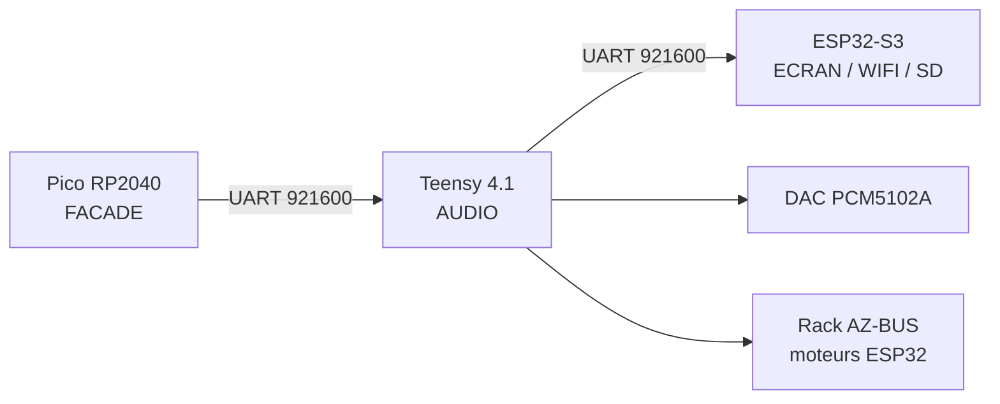

# AZ-3 — Panneau de contrôle Pico (matrice, encodeurs, LED)

**Version :** V1, 19 septembre 2026
**Statut :** code écrit, **rien de vérifié sur le vrai matériel** — le Pico
n'était pas branché au moment de l'écriture.
**Branche :** `az3`

## Décision d'architecture

L'AZ-3 sépare nettement les trois cerveaux, chacun avec un rôle unique :



| Carte | Rôle | Sources |
|---|---|---|
| **ESP32-S3** | écran 480×480, Wi-Fi, carte SD, projets, émulateur GB/GBC | `src_esp32/az2_screen/` |
| **Teensy 4.1** | moteurs audio, séquenceur, DAC PCM5102A, rack AZ-BUS | `src_teensy/az2_audio/` |
| **Pico RP2040** | **toute la façade** : matrice, encodeurs, LED | `src_pico/` |

Le Teensy ne garde **aucune** commande. C'est le retournement complet de la
décision du 2026-09-14, où le Pico avait été abandonné et les commandes
recâblées en direct sur le Teensy.

## Ce qui disparaît, et pourquoi ça ne casse rien

La croix directionnelle et les boutons A/B/C/D **n'existent plus en
matériel**. Leurs messages `NAV:` et `BTN:`, eux, continuent d'exister : le
Pico les **synthétise** depuis ses encodeurs.

C'est le point de conception qui économise le plus de travail. L'UI de
l'ESP32 (4680 lignes) consomme déjà ce vocabulaire pour naviguer dans les
menus, déplacer le curseur du tracker et piloter l'émulateur. En gardant le
protocole identique, **elle n'a pas été modifiée d'une seule ligne**.

| Ancien matériel AZ-2 | Remplacé par | Message émis |
|---|---|---|
| Croix ↑ ↓ | Encodeur 1, rotation | `NAV:UP` / `NAV:DOWN` |
| Croix ← → | Encodeur 2, rotation | `NAV:LEFT` / `NAV:RIGHT` |
| Bouton A (valider) | Encodeur 1, clic | `BTN:A` |
| Bouton B (retour) | Encodeur 2, clic | `BTN:B` |
| Potard 1 (volume) | Encodeur 3, rotation | `POT:0` |
| Potard 2 (reverb) | Encodeur 4, rotation | `POT:1` |
| Bouton C / D | Encodeurs 3 / 4, clic | `BTN:C` / `BTN:D` |
| Potard 3 (delay) | *aucun* avec 4 encodeurs | `POT:2`, écran seulement |

### Limite assumée : le mode Jeux perd sa croix

Un encodeur émet une **impulsion** (`DOWN` puis `UP` immédiat), il ne peut
pas *maintenir* une direction. C'est sans conséquence pour les menus —
l'ESP32 agit sur `:DOWN` — mais l'émulateur Game Boy a besoin qu'on tienne
une direction. Il faudra mapper les 4 directions GB sur 4 pads de la
matrice, qui eux savent rester enfoncés. **Pas encore fait.**

## Brochage du Pico

Le RP2040 a **26 broches utilisables** : GPIO 0-22 et 26-28. GPIO 23 pilote
le mode d'alimentation SMPS, GPIO 24 détecte le VBUS, GPIO 25 est la LED
embarquée — les trois sont exclues.

| Usage | GPIO | Nb | Sens |
|---|---|---:|---|
| UART → Teensy `Serial7` | 0 (TX), 1 (RX) | 2 | — |
| Colonnes matrice COL_0-3 | 2, 3, 4, 5 | 4 | sortie (LOW au scan) |
| Lignes matrice ROW_0-3 | 6, 7, 8, 9 | 4 | entrée `INPUT_PULLUP` |
| Adresse mux S0-S3 (**partagée**) | 10, 11, 12, 13 | 4 | sortie |
| Mux **LED** SIG | 14 | 1 | sortie, **résistance série** |
| Mux **IN** SIG | 15 | 1 | entrée `INPUT_PULLUP` |
| Encodeur 1 A/B | 16, 17 | 2 | entrée `INPUT_PULLUP` |
| Encodeur 2 A/B | 18, 19 | 2 | entrée `INPUT_PULLUP` |
| Encodeur 3 A/B | 20, 21 | 2 | entrée `INPUT_PULLUP` |
| Encodeur 4 A/B | 22, 26 | 2 | entrée `INPUT_PULLUP` |
| LED embarquée (heartbeat) | 25 | — | sortie (interne) |
| **Libres** | **27, 28** | **2** | — |

Les **boutons** d'encodeur ne consomment aucune GPIO : ils passent par le
mux d'entrée (canaux 0 à 3).

### Deux CD74HC4067 partageant les lignes d'adresse

C'est l'astuce qui rend le brochage tenable : les deux multiplexeurs
reçoivent les **mêmes** S0-S3 et gardent chacun leur propre broche SIG.
Résultat : **32 canaux pour 6 broches** au lieu de 10.

| | Mux LED (sortie) | Mux IN (entrée) |
|---|---|---|
| S0-S3 | GPIO 10-13 (partagés) | GPIO 10-13 (partagés) |
| SIG | GPIO 14 | GPIO 15 |
| Canaux 0-3 | Rouge, lignes 0-3 | Boutons encodeurs 1-4 |
| Canaux 4-7 | Vert, lignes 0-3 | *libres* |
| Canaux 8-11 | Bleu, lignes 0-3 | *libres* |
| Canaux 12-15 | *inutilisés* | *libres* |

Il n'y a pas de conflit : pendant la lecture du mux IN, la broche SIG du mux
LED est maintenue à LOW, donc aucune LED ne s'allume même si l'adresse
change.

### ⚠ La broche EN — la panne qui a coûté le projet en 2026-09

**La broche EN de CHAQUE CD74HC4067 doit être reliée au GND commun.**

Elle est active à l'état **BAS**. Laissée en l'air, le multiplexeur entier
reste désactivé en permanence : aucun canal ne passe jamais, quoi que
fassent S0-S3 et SIG. C'est exactement le symptôme observé le 2026-09-14 —
zéro LED sur les 48 combinaisons testées, alors que boutons et alimentation
du mux étaient corrects — et c'est ce qui a fait abandonner le Pico.

La cause avait été identifiée, **mais la correction (EN → GND) n'a jamais
été revérifiée** avant que le projet soit abandonné. Le chemin mux LED est
donc conservé tel quel dans le firmware : c'est un test de cinq minutes, pas
un chantier.

Autre rappel de courant : le CD74HC4067 est un **commutateur analogique**,
pas un driver. Une résistance série sur la ligne SIG du mux LED est
indispensable, et n'allumer qu'un canal à la fois (ce que fait le firmware)
reste la seule façon sûre de procéder. Si la luminosité s'avère
insuffisante une fois le mux fonctionnel, la suite est un vrai driver à
courant constant (IS31FL3731) ou des LED adressables par pad — pas un
réglage du mux.

## Matrice SparkFun 4×4 RGB

C'est une **vraie matrice** ligne/colonne, pas 16 boutons indépendants :
appuyer sur un pad relie sa ligne à sa colonne. Les LED sont trois matrices
4×4 superposées, une par couleur, partageant les **mêmes 4 colonnes**
(cathodes communes).

Référence : <https://learn.sparkfun.com/tutorials/button-pad-hookup-guide/all>

Nommage AZ-2 (`pad = ligne*4 + colonne`, voir `az2::padId`) :

| | COL_0 | COL_1 | COL_2 | COL_3 |
|---|---|---|---|---|
| **ROW_0** | 0 | 1 | 2 | 3 |
| **ROW_1** | 4 | 5 | 6 | 7 |
| **ROW_2** | 8 | 9 | 10 | 11 |
| **ROW_3** | 12 | 13 | 14 | 15 |

Deux pièges documentés par SparkFun :

- les connexions du bas sont des **colonnes**, pas de vrais GND — suivre le
  guide plutôt que de deviner au multimètre en mode continuité ;
- **errata Vert/Bleu inversé** sur certains lots. Si les couleurs sortent
  échangées à l'usage, c'est ça : inverser les deux fils.

## Choix logiciels à connaître

### Quadrature : sondage fréquent, pas interruption

Le balayage LED en POV peut occuper jusqu'à ~7 ms par tour de boucle (4
colonnes × jusqu'à 12 impulsions de 150 µs). Si on ne lit les encodeurs
qu'une fois par tour, une rotation rapide franchit plusieurs crans entre
deux lectures et le firmware en perd. Le défaut existait dans le firmware
Pico d'origine où il passait inaperçu, précisément parce que presque aucune
LED ne s'allumait — la boucle était donc rapide.

`pollEncoders()` est appelé **depuis l'intérieur du balayage LED, après
chaque impulsion**. L'intervalle maximal entre deux lectures tombe ainsi à
~150 µs, largement sous la milliseconde qui sépare deux transitions même sur
une rotation très rapide. Coût : 2 `digitalRead` par encodeur, soit ~5 % du
temps d'une impulsion.

La traduction en messages (`drainEncoderRotation`) est séparée de
l'échantillonnage : l'émission série n'a rien à faire au milieu d'un
balayage, elle étirerait l'impulsion en cours et ferait clignoter la
matrice.

**Pourquoi pas `attachInterrupt()`**, théoriquement plus propre : sur le
cœur Arduino-mbed, `attachInterrupt` crée un objet `InterruptIn` qui prend
la main sur la broche, et faire un `digitalRead` de cette même broche depuis
l'ISR est un comportement qui demande une validation sur le vrai matériel.
Le sondage réutilise exactement le chemin de code déjà confirmé fonctionnel
le 2026-09-13. Si la quadrature s'avère malgré tout trop lente une fois les
LED réellement allumées, **l'interruption est le plan B**.

### Scan en deux passes

Les boutons de la matrice sont lus sur les 4 colonnes **avant** la phase
LED, jamais en alternance colonne par colonne. Sinon, appuyer sur un pad de
la colonne 3 attend que les colonnes 0-2 aient fini boutons *et* LED, soit
du temps mort ajouté avant même l'envoi de l'événement. Comportement établi
lors du rapport temps réel du 2026-09-14 — à ne pas « simplifier ».

### Table des rôles

Ajouter ou retirer un encodeur se fait **à un seul endroit**, la table
`kEncoders` dans `src_pico/main.cpp` :

```cpp
constexpr EncoderConfig kEncoders[] = {
    {16, 17, EncoderRole::NavVertical,   0, 'A',   0},
    {18, 19, EncoderRole::NavHorizontal, 0, 'B',   0},
    {20, 21, EncoderRole::Pot,           0, 'C', 100},  // volume
    {22, 26, EncoderRole::Pot,           1, 'D',   0},  // reverb
};
```

Le reste du firmware s'adapte tout seul (nombre d'encodeurs, canaux de mux,
interruptions, annonce au boot).

## Combien d'encodeurs peut-on mettre ?

Un encodeur coûte **2 broches** (la quadrature doit rester sur de vraies
GPIO ; un mux lui ferait rater des crans). Le bouton, lui, est lent et ne
coûte rien — il va sur le mux.

| Encodeurs | Tient sur un Pico ? | Comment |
|---:|---|---|
| 4 | ✅ **2 broches de marge** | brochage ci-dessus, tel quel |
| 5 | ✅ 0 de marge | utiliser GPIO 27, 28 |
| 6-7 | ✅ 0 de marge | déporter **en plus** les 4 lignes de matrice sur le mux IN (canaux 4-7), ce qui libère GPIO 6-9 |
| **8+** | ❌ **28 broches nécessaires, 26 disponibles** | carte RP2350**B** (Pico Plus 2, 48 GPIO) |

⚠ **Piège d'achat** : un « Pico 2 » standard embarque un RP2350**A** et a
exactement les mêmes 26 GPIO qu'un Pico 1. Il ne résout rien. Seul le
RP2350**B** (boîtier QFN-80, 48 GPIO) apporte des broches.

## Côté Teensy

### 17 broches libérées

Le retrait des commandes locales libère les GPIO **2-6, 8, 9, 14-19, 22-25**
— et c'est le but : le rack AZ-BUS a besoin de broches (un UART par slot,
RESET/BOOT, SLOT_PRESENT, entrée I2S). Voir
[AZ2_BUS_RACK_MOTEURS.md](AZ2_BUS_RACK_MOTEURS.md).

### Liaison vers le Pico : `Serial7`, pins 28/29

Pourquoi pas `Serial3` (pins 14/15), l'ancien lien Pico : ces broches
avaient été réaffectées à l'encodeur 1 en AZ-2. `Serial2` (7/8) et `Serial5`
(20/21) touchent l'I2S ou d'anciens boutons. `Serial7` est libre et le
reste.

| Pico | Teensy 4.1 |
|---|---|
| GPIO 0 (TX) | pin 28 (RX7) |
| GPIO 1 (RX) | pin 29 (TX7) |
| GND | GND |

Débit : `az2::kControlBaud` (921600). Les deux firmwares utilisent la
constante partagée, les deux bouts restent donc d'accord automatiquement.
**La masse commune est obligatoire.**

### Traitement des messages entrants

| Message | Ce que fait le Teensy |
|---|---|
| `PAD:NN:DOWN/UP/HOLD` | joue la voix live *(handler existant)* |
| `MACRO:<n>:±N` | transpose *(handler existant)* + relaie |
| `POT:<0-2>:<0-127>` | **applique** volume / reverb / delay + relaie |
| `NAV:`, `BTN:`, `ENC:` | relaie tel quel vers l'ESP32 |
| `HELLO:PICO_KEYPAD` | répond `HELLO:TEENSY_AUDIO` sur `Serial7` |

## Procédure de test au rebranchement

À faire **dans cet ordre**. Les étapes 1 à 3 ne demandent pas le Teensy.

1. **Flasher** : `pio run -e ctrl_pico -t upload`.
2. **Moniteur série USB** (921600) : attendre
   `AZ2:ROLE:PICO_KEYPAD`, `AZ2:FEATURE:SPARKFUN_4X4_MATRIX`,
   `AZ2:FEATURE:ENCODERS_4`, `AZ2:FEATURE:NAV_FROM_ENCODERS`, puis le
   heartbeat `STATUS:PICO_KEYPAD:READY` une fois par seconde. La LED
   embarquée doit clignoter 2×/s.
3. **Matrice** : chaque pad doit produire `PAD:00` à `PAD:15` en `DOWN` /
   `UP`, et `HOLD` après 600 ms. *(Confirmé fonctionnel le 2026-09-13 sur le
   firmware d'origine.)*
4. **Mux d'entrée** : commande `MUXTEST` → affiche l'état des 16 canaux.
   Les canaux 0-3 doivent passer à `1` quand on clique l'encodeur
   correspondant. **Si les 16 canaux restent figés, vérifier EN → GND.**
5. **Mux LED** : commande `LEDTEST` (défilement ~0,7 s par canal, une LED
   doit rester allumée en continu à chaque étape) ou `LEDTEST:ALL` (les 4
   colonnes ensemble, jusqu'à 4 LED à la fois — pratique si une seule LED
   est HS). `LEDTEST:STOP` pour revenir au scan normal.
   **C'est le test décisif : il tranche la panne de 2026-09.**
   Les encodeurs sont volontairement inertes pendant `LEDTEST` — lire le mux
   d'entrée changerait l'adresse partagée et déplacerait la LED que le
   diagnostic doit maintenir figée.
6. **Encodeurs** : rotation → `NAV:UP`/`DOWN`, `NAV:LEFT`/`RIGHT`,
   `POT:0:<v>`, `POT:1:<v>`. Clic → `BTN:A` à `BTN:D`.
7. **Lien Teensy** : câbler GPIO 0/1 → pins 28/29 + GND, flasher le Teensy,
   vérifier `HELLO:TEENSY_AUDIO` en retour (le Pico le réaffiche préfixé
   `TEENSY:`).
8. **Chaîne complète** : tourner l'encodeur 3 doit changer le volume audible
   *et* la valeur affichée à l'écran.

## État de vérification

| Élément | État |
|---|---|
| Scan matrice 4×4 (`PAD:`) | ✅ confirmé sur matériel le 2026-09-13 |
| Encodeurs, rotation et clic | ✅ confirmés le 2026-09-13 (3 encodeurs, câblage direct) |
| Heartbeat, boot, LED embarquée | ✅ confirmés le 2026-09-13 |
| Retour LED via mux | ❌ **jamais fonctionné**, correction EN → GND jamais retestée |
| Mux d'entrée (boutons encodeurs) | ❌ nouveau, jamais câblé |
| Quadrature par sondage fréquent | ❌ nouveau, jamais testé |
| Synthèse `NAV:`/`BTN:` depuis les encodeurs | ❌ nouveau, jamais testé |
| Teensy sans commandes locales | ❌ nouveau, compile seulement |
| Lien `Serial7` | ❌ nouveau, jamais câblé |
| Directions Game Boy sur les pads | ❌ **pas fait** — le mode Jeux n'a plus de croix |
